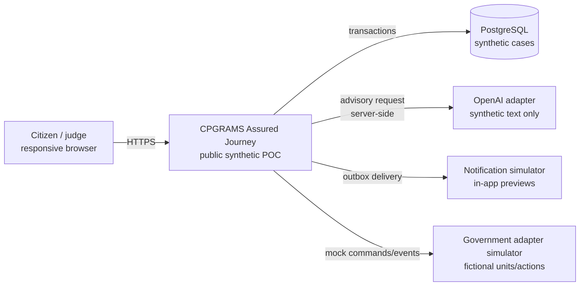
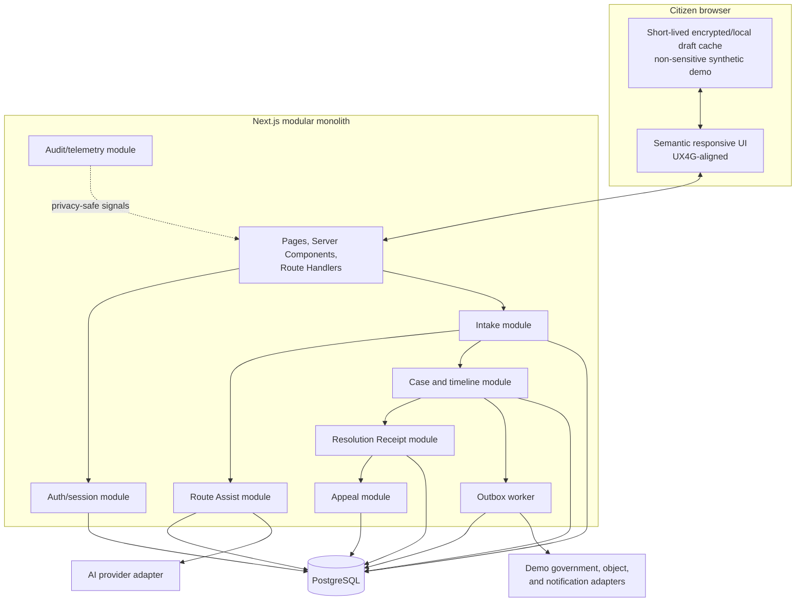
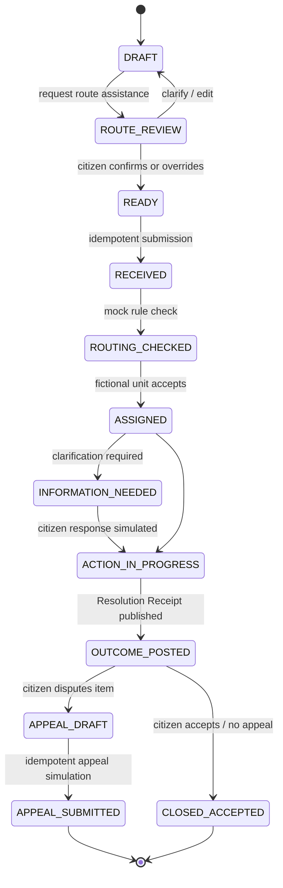
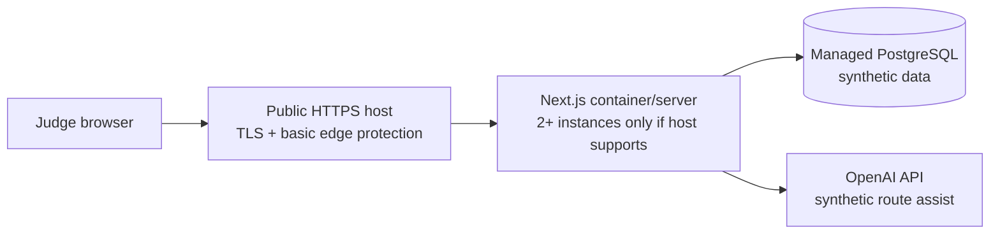

# 03 — Hackathon prototype architecture

## Objective

Demonstrate one complete, dependable citizen journey in a browser:

```text
describe → route suggestion → citizen confirmation → relevant questions → submit
→ immediate receipt → durable timeline → Resolution Receipt → context-preserving appeal
```

The proof of concept must work end to end for judges with seeded test credentials and synthetic data. It is not a production reimplementation of CPGRAMS and does not include an officer/admin product beyond mocked, deterministic state transitions needed for the citizen demo.

## System context



## Container view



## Domain module responsibilities

| Module | Owns | Does not own |
| --- | --- | --- |
| Identity/session | Synthetic demo user, session, sign-in/out, session freshness | Real government identity, Aadhaar, OTP, officer authority |
| Intake | Draft, original statement, language preferences, clarifications, category form data | Final route decision or official outcome |
| Routing | Route candidates, deterministic rule results, citizen confirmation/override | Autonomous rejection or hidden reassignment |
| Case | Case ID, current projection, append-only timeline, participant access | Provider-specific notification or AI code |
| Resolution Receipt | Requested outcome items, official action items, evidence links, unresolved gaps, closure explanation | Merits decision; mock data simulates an authorised official action |
| Appeal | Eligibility display, disputed items, inherited context, appeal draft/submission simulation | Appeal adjudication |
| Notifications | Delivery preference and outbox events | Direct vendor implementation in the domain |
| Audit | Actor/action/reason events and privacy-safe telemetry correlation | Complaint body or attachment content in logs |

## Data model

### Core tables

| Table | Important fields and constraints |
| --- | --- |
| `app_user` | synthetic ID, display name, locale; no real citizen data |
| `session` | library-managed token/session data, expiry, revocation; protected indexes |
| `grievance_draft` | owner, original text, interface/input/response language, version, autosave timestamp |
| `route_catalogue` | versioned fictional ministry/unit/category, jurisdiction rules, examples, active range |
| `route_suggestion` | draft, model/rules version, candidate routes, confidence band, explanation, schema-valid response hash |
| `route_confirmation` | selected route, source (`suggested`, `searched`, `override`), citizen timestamp, explanation shown |
| `grievance_case` | synthetic registration ID, owner, confirmed route, current state/version, created/updated timestamps |
| `requested_outcome` | one row per citizen-requested result, immutable text snapshot and order |
| `case_event` | append-only event type/version, actor class/ID, reason, correlation ID, happened/recorded time, metadata |
| `evidence_item` | safe sample object reference, media type, display name, hash, classification, scan status |
| `resolution_item` | requested-outcome link, action, result (`resolved`, `partly_resolved`, `unresolved`), reason, evidence refs |
| `appeal` | case, disputed resolution items, inherited record version, grounds, current state |
| `notification_preference` | channel choice for simulation; no real destination required |
| `outbox_event` | event ID/type/version, aggregate ID, payload, attempts, next attempt, delivered timestamp |
| `audit_event` | append-only security/business action, actor, target, purpose/reason, timestamp, correlation ID |

### Database invariants

- Registration IDs and idempotency keys are unique.
- A case cannot be submitted without a confirmed route and at least one requested outcome.
- The original complaint text is immutable after submission; corrections are linked addenda/events.
- State changes use optimistic locking (`version`) and an allowed-transition table/function.
- A Resolution Receipt cannot be published without at least one resolution item, responsible unit, action date, and reason.
- Each resolution item must reference a requested outcome or be explicitly labelled “additional action.”
- Appeal creation stores the exact Resolution Receipt version being disputed.
- Timeline and audit rows cannot be updated/deleted by the application role.
- Attachment metadata never treats the browser filename or media type as trusted.

## Case state machine



The UI uses plain-language labels, while APIs/events keep stable machine names. No case jumps from `RECEIVED` directly to `OUTCOME_POSTED` without intermediate events; demo controls can generate those events quickly but visibly.

## Describe-first route-assistance sequence

```mermaid
sequenceDiagram
    participant C as Citizen
    participant W as Web application
    participant D as Case database
    participant R as Deterministic rules
    participant A as AI adapter

    C->>W: Enter synthetic grievance in chosen language
    W->>D: Autosave original text and language
    W->>W: Validate length, file references, and scope-safe input
    par Independent candidate checks
      W->>R: Match jurisdiction/routing rules
      W->>A: Send synthetic text with strict output schema
    end
    A-->>W: Candidates, confidence band, reason, clarifying questions
    R-->>W: Allowed/blocked candidate routes and rule reasons
    W->>W: Validate schema; intersect/rank; apply fallback
    W-->>C: Show suggestion, why, uncertainty, alternatives
    C->>W: Confirm, search, or override
    W->>D: Persist citizen-confirmed route and explanation shown
    W-->>C: Reveal only route-relevant questions/evidence checklist
```

### AI output contract

The AI adapter returns no prose outside a strict schema resembling:

```json
{
  "schemaVersion": "1.0",
  "inputLanguage": "hi",
  "summary": "Clearly labelled synthetic summary",
  "candidates": [
    {
      "routeCode": "TEL-MOBILE-SERVICE",
      "confidenceBand": "medium",
      "reason": "The complaint concerns mobile service activation and billing.",
      "supportingTerms": ["mobile service", "bill"]
    }
  ],
  "clarifyingQuestions": [],
  "possibleScopeExclusion": null
}
```

Never display chain-of-thought. Display a short, user-facing explanation generated from supported terms/rules. Treat `confidenceBand` as model self-report unless calibrated on the labelled synthetic evaluation set.

### Fallback rules

| Failure | Citizen experience | System response |
| --- | --- | --- |
| AI timeout/unavailable | “Route suggestions are temporarily unavailable” plus searchable catalogue | Preserve draft; do not block filing |
| Invalid AI schema | Same as unavailable; no raw model text | Record privacy-safe provider error and correlation ID |
| AI/rule conflict | Show supported rule-valid candidates and ask citizen | Never silently select a disallowed route |
| Low confidence | Show two or three options with examples | Require citizen confirmation |
| Possible out-of-scope matter | Explain the policy boundary and proposed handoff; allow correction | Do not auto-reject; provide reviewed next-service link in production |
| Language mismatch | Show detected input language and immediate override | Preserve original text and rerun only on user request |

## API surface for the POC

All write endpoints require a session, CSRF protection as supplied by the auth framework, content-type/size limits, schema validation, object-level authorisation, idempotency where relevant, and a correlation ID.

| Method/path | Purpose |
| --- | --- |
| `POST /api/v1/demo/session` | Sign in with a seeded synthetic test account |
| `GET /api/v1/me/cases` | List the signed-in user's cases; no repeated case/contact fields |
| `POST /api/v1/drafts` | Create an autosaved draft |
| `PATCH /api/v1/drafts/{id}` | Version-checked autosave |
| `POST /api/v1/drafts/{id}/route-suggestions` | Generate advisory route candidates |
| `PUT /api/v1/drafts/{id}/route-confirmation` | Confirm/search/override a route |
| `POST /api/v1/cases` | Idempotently submit a complete synthetic case |
| `GET /api/v1/cases/{id}` | Read the authorised case projection and timeline |
| `GET /api/v1/cases/{id}/resolution-receipt` | Read a versioned Resolution Receipt |
| `POST /api/v1/cases/{id}/appeals` | Create/submit a context-preserving synthetic appeal |
| `POST /api/v1/demo/cases/{id}/advance` | Test-only transition, protected and absent from production builds |

Use RFC Problem Details-compatible errors with stable codes such as `SESSION_EXPIRED`, `CASE_NOT_FOUND`, `CASE_ACCESS_DENIED`, `VERSION_CONFLICT`, `ROUTE_ASSIST_UNAVAILABLE`, and `INVALID_TRANSITION`. Error pages preserve the intended return URL and show a support correlation ID without revealing internal details.

## Session and recovery design

- Database-backed sessions with secure, HttpOnly, SameSite cookies in deployed HTTPS.
- Protected queries verify both session and case ownership; a visible dashboard session is not enough.
- Autosave uses optimistic versions and shows “saved”/“saving”/“could not save” as programmatic status messages.
- A warning appears before expiry with “Continue session” and “Save and sign out.”
- Reauthentication uses a validated same-origin return token, never an arbitrary redirect URL.
- Opening a case in a new tab performs a normal server-side ownership check and must work.
- Public unauthenticated lookup is not needed for the judged POC; its future API remains separate from signed-in access.

## Resolution Receipt contract

The receipt is the primary product artefact. It contains:

- immutable case/receipt version and synthetic registration ID;
- filing language and chosen response language;
- original citizen statement and separately labelled summary;
- confirmed route, explanation, responsible unit, and route history;
- each requested outcome as a distinct item;
- official/mock action and action date for each item;
- relied-upon evidence/document references;
- outcome per item: resolved, partly resolved, or unresolved;
- speaking reason and any limitation/next step;
- citizen feedback per item;
- appeal eligibility, deadline text, and prefilled disputed items;
- integrity metadata for export in a future implementation, without false “blockchain” claims.

## Performance and accessibility budgets

These are POC quality gates, not production SLAs:

| Measure | Target |
| --- | --- |
| First contentful citizen page on a normal broadband profile | under 1.5 seconds in the deployed demo where practical |
| Largest Contentful Paint at p75 lab/field-like test | under 2.5 seconds |
| Cumulative Layout Shift | under 0.1 |
| Interaction to Next Paint | under 200 ms for non-AI controls |
| Non-AI API p95 in synthetic load test | under 500 ms |
| Route-assist response | progressive status, timeout around 8–12 seconds, full manual fallback |
| JavaScript | no heavy animation/3D/avatar; route-level code splitting |
| Responsive reflow | full journey at 320 CSS px and 200% zoom without two-dimensional scrolling for ordinary content |
| Keyboard | every action reachable with visible focus; no keyboard trap |
| Screen reader | labels, headings, errors, status messages, timeline, and receipt relationships announced |
| Language | correct page/part language attributes; interface language can change without losing draft |

WCAG 2.2 AA is the voluntary engineering target because it extends 2.1 and adds relevant criteria for focus, target size, redundant entry, and accessible authentication. GIGW 3.0's formal baseline remains WCAG 2.1 AA. Source: [W3C WCAG 2.2](https://www.w3.org/TR/WCAG22/).

## Demo deployment



Requirements:

- a public browser URL and seeded test credentials;
- deployment health/readiness endpoint;
- environment variables managed by the host, never committed;
- production build and database migration run from CI/release procedure;
- demo/reset seed isolated from normal request paths;
- OpenAI key server-side only, with spend/rate limits;
- visible “demonstration with synthetic data” notice;
- no dependency on the developer laptop being online.

## Two-minute judge path

1. Sign in as a seeded synthetic citizen.
2. Enter a short Hindi or English grievance without selecting a department.
3. Show explainable route suggestion and citizen confirmation/override.
4. Submit and immediately show receipt, owner, next checkpoint, notification preview, and timeline.
5. Use a protected demo transition to publish a Resolution Receipt.
6. Show one resolved and one unresolved requested outcome with evidence.
7. Open an appeal draft already populated with the original record and disputed item.
8. State the boundary: AI assists; citizens confirm; authorised humans decide; all real integrations are mocked.

## POC definition of done

- The complete path above works in a fresh judge browser with provided credentials.
- Refresh, same-tab, and new-tab case access preserve authorised continuity.
- No real government endpoint or personal data is used.
- Every state change appears once in the timeline and has an audit actor/reason.
- Route assistance has a working manual fallback.
- The Resolution Receipt and appeal are not static images; judges can interact with them.
- Automated unit/integration/E2E/accessibility checks pass, and manual keyboard/zoom/screen-reader checks are recorded.
- The public build has no demo-transition endpoint except the explicitly protected judge control.
- The source and demo visibly avoid claiming official CPGRAMS affiliation or production security certification.
