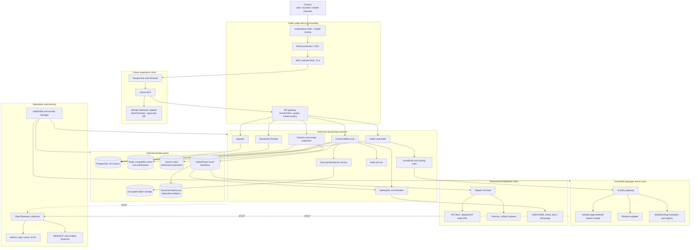
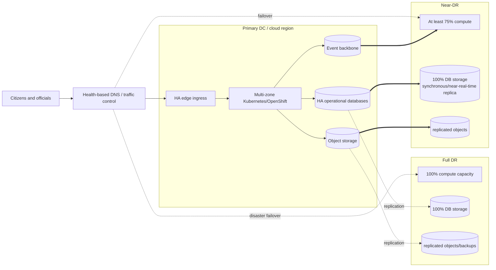
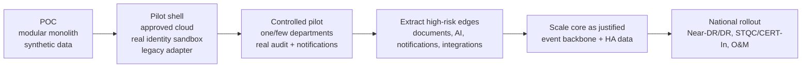

# 04 — Future government production target

## Status and assumptions

This is a reference architecture for a later **authorised** implementation. It is not the deployed hackathon architecture and does not claim approval by DARPG, NIC, MeitY, STQC, CERT-In, or any cloud provider.

It assumes:

- an owning government organisation defines policy, records, retention, roles, SLAs, and lawful data processing;
- hosting occurs on NIC or a MeitY-empanelled cloud chosen through the applicable process;
- real identity, Bhashini, notification, CPGRAMS, API Setu, and department/state integrations have formal agreements and audited APIs;
- the citizen experience and Resolution Receipt are introduced through a pilot rather than a big-bang replacement;
- official NextGen availability, recovery, security-audit, and portability requirements are minimum baselines.

## Target logical architecture

This diagram shows logical responsibilities, not an instruction to deploy every box as an independent microservice on day one.

## Deployment topology

The RFP requires Near-DR at at least 75% compute and 100% storage with RPO ≤5 minutes and RTO <30 minutes. Full DR requires 100% compute/storage with RPO ≤15 minutes and RTO <1 hour. The exact active-active/active-passive database topology must be selected after consistency, latency, CSP capabilities, cost, and failure-mode testing; “active-active” is not a substitute for a conflict model.

## Service-boundary plan

| Logical capability | Initial deployment recommendation | Extract when |
| --- | --- | --- |
| Citizen BFF/web | Separate frontend deployment | Independent edge scaling and release cadence already justify it |
| Intake/routing/case/receipt/appeal | One core service or a small set of services in the pilot | Different ownership, scale, confidentiality, or release cycles become real |
| Document/evidence | Early separate service | Files need isolated malware scanning, object permissions, quotas, and lifecycle controls |
| Notifications | Early separate worker/service | Slow/unreliable channels require queues, retries, delivery receipts, and provider switching |
| AI/language gateway | Separate controlled zone | Distinct compute, data-egress, model governance, and audit requirements already exist |
| External adapters | Separate integration services | Government APIs change independently and need circuit breakers, mapping, and credentials isolation |
| Audit | Append-only write path plus independently controlled export/store | Independence is needed to detect application-level tampering |
| Analytics/lakehouse | Separate data plane | Analytical access, retention, aggregation, and scale differ from case transactions |

## Data ownership and storage

### Operational system of record

- PostgreSQL remains the source of truth for case metadata, state, requested outcomes, route decisions, Resolution Receipts, appeals, and transactional outbox records.
- Each extracted service owns its schema and publishes contracts; other services do not query its tables.
- Strongly consistent case writes stay within one ownership boundary. Cross-service workflows use sagas/process managers and idempotent events, not distributed transactions.
- Append-only business events support the citizen timeline and audit reconstruction. They do not eliminate the need for authoritative current projections, retention rules, and signed audit exports.

### Documents and evidence

- Private, encrypted object storage with per-object access policy and opaque object IDs.
- Upload quarantine, file-signature validation, size/page limits, malware scanning, content-disarm/reconstruction decision, OCR sandbox, and manual escalation for unsupported files.
- Pre-signed access URLs are short lived and bound to authorised actions.
- Object metadata and hashes are in the system of record; application logs never contain object content or pre-signed URLs.

### Search

- Search is an authorised projection, never the source of truth.
- Index only the minimum fields needed for role-authorised search.
- Treat index updates as events and provide replay/rebuild.
- Apply document/case access filtering at query and result level; never rely on hidden UI fields.

### Analytics/lakehouse

- Separate raw, curated, aggregate, and published zones with catalogue, lineage, quality rules, access approvals, and retention.
- Remove/directly protect personal identifiers; prefer aggregate/non-PII datasets for dashboards and open APIs.
- Operational case access does not imply analytics access.
- “Citizen 360” requires purpose, authority, minimisation, and governance; it is not a default product entitlement.

## API and event architecture

### Synchronous APIs

- REST/OpenAPI 3.1 at the public/partner boundary unless an approved standard requires otherwise.
- OAuth2/OIDC or mutually authenticated service identity, depending on consumer.
- Fine-grained object and function authorisation; deny by default.
- Idempotency keys for create/submit/appeal/reminder operations.
- Correlation IDs and Problem Details-compatible errors.
- No sensitive data in URLs/query strings.
- Quotas, schema validation, payload limits, timeouts, and circuit breakers at the gateway and service.
- Explicit API versions, deprecation dates, contract tests, and the Open API policy goal of two-version backward compatibility.

### Asynchronous events

An event envelope contains:

- `eventId`, `eventType`, `eventVersion`, `aggregateType`, `aggregateId`;
- `occurredAt`, `recordedAt`, `source`, `correlationId`, `causationId`;
- actor class and privacy-safe actor reference;
- data classification and schema reference;
- minimal payload or secure object reference.

Consumers use event IDs for idempotency. Dead-letter handling requires an owned runbook, alerts, replay controls, and redaction-safe inspection. Schema compatibility is checked in CI and at broker registration.

## Integration adapters

| Integration | Architecture rule |
| --- | --- |
| CPGRAMS/core department systems | Use formal versioned API/event contracts; no screen scraping; preserve authoritative IDs and acknowledgement receipts |
| API Setu | Publish/consume through approved onboarding, identity, consent, rate, and lifecycle policies |
| Bhashini | Adapter for ASR, translation, TTS, and language detection; preserve original text/audio and visibly identify machine translation |
| Identity | OIDC/OAuth2 federation through approved government identity; separate citizen and official assurance/role sources |
| Parichay/official systems | Dedicated adapter and service identity; least privilege and full audit |
| SMS/email/WhatsApp | Notification orchestration, consent/preferences, approved templates, delivery receipts, retries, and channel fallback |
| State/central portals | Canonical grievance/event model plus per-system mappings; quarantine invalid data instead of corrupting the core |
| DigiLocker/documents | Consent and purpose-bound retrieval; do not copy documents indefinitely by default |

## Language and AI zone

The official RFP's LLM controls require an exclusive isolated processing environment with no provider/third-party access, no data leaving the environment, no provider retention/logging, encryption at rest/in transit, customer-managed keys, auditable access, secure deletion, MFA, and DPDP/government compliance.

Production therefore uses:

1. an AI policy gateway that authenticates callers and classifies/minimises inputs;
2. PII redaction/tokenisation where compatible with the task;
3. an approved self-hosted or dedicated isolated model endpoint inside the controlled environment;
4. allow-listed tasks and schemas rather than general chat;
5. model/prompt/schema registry with immutable version references;
6. deterministic post-validation and human/citizen decision points;
7. quality, bias, language, drift, and refusal evaluation on approved representative data;
8. emergency kill switch and a non-AI filing path;
9. separate Bhashini adapters for language capabilities rather than pretending an LLM is the only multilingual component.

## Scalability model

- Stateless web/BFF and most service pods scale horizontally behind load balancers.
- Database connection pools are bounded per workload; read replicas serve suitable read-only projections, never stale authorisation decisions.
- Cache is non-authoritative and has explicit invalidation/TTL; sensitive cache entries are encrypted/isolated and minimised.
- Outbox/broker partitions scale by stable case/tenant keys where ordering is required.
- AI, OCR, document scanning, and notifications are queued with concurrency limits and backpressure.
- Per-user/IP/client rate limits distinguish normal citizens, assisted channels, partner APIs, and suspicious automation.
- Bulk analytics never runs on the primary transactional database.
- Capacity plans include normal, seasonal, incident, campaign, and integration-replay load plus at least the RFP's documented annual data growth baseline.

## Reliability and SLO proposal

The RFP's contractual minimum is at least 99.7% monthly availability. A future design should consider a higher internal SLO for the core citizen journey, subject to cost and owner approval.

| User journey / signal | Proposed internal objective | Notes |
| --- | --- | --- |
| Public landing/help/static guidance | 99.95% availability | Aggressively cacheable and degradable |
| Sign-in, list cases, view timeline/receipt | 99.9% | High citizen-trust path |
| Submit grievance/appeal | 99.9% successful accepted writes | Idempotent and durable; queue external side effects |
| Route assistance | 99.0% AI availability with 100% manual fallback | AI must not become a filing dependency |
| Notification dispatch | 99% accepted into outbox promptly | External channel delivery has separate SLIs |
| Non-AI API latency | p95 defined per operation after load test | Do not invent one latency for all workloads |
| AI/language latency | SLI by task/language/model | Progressive feedback and timeout/fallback required |

Use error budgets to decide release pace. Availability excludes only formally approved maintenance as defined by the owner/contract, not every deployment.

## Portability and anti-lock-in

- OCI container images and Kubernetes/OpenShift-compatible manifests.
- Infrastructure as code using an approved portable tool, with provider-specific modules isolated.
- PostgreSQL, S3-compatible object APIs, OpenTelemetry, OpenAPI, OAuth/OIDC, and standard event schemas.
- No provider-specific database or identity feature in core domain logic without an ADR and exit plan.
- Exportable data, schema, keys/rotation procedure, configuration, runbooks, dashboards, and audit evidence.
- Rehearsed CSP exit/migration including secure source deletion and ownership transfer.

MeitY's cloud empanelment material requires Indian hosting/data processing and no backup transfer outside India, and asks providers for standard-format data portability and secure disposal. The 2024 checklist includes ISO 27001, ISO 20000-1, ISO 27017, ISO 27018, and Tier III-or-higher data-centre evidence. Source: [MeitY cloud empanelment document](https://www.meity.gov.in/writereaddata/files/Empanelment-Cloud-Service-Offering-March%202024.pdf).

## Evolution from the POC

### Migration rules

- Strangle journeys behind stable APIs rather than migrating every table and screen at once.
- Start read-only with shadow projections; reconcile against the authoritative legacy record.
- Introduce idempotent dual-write/outbox only with reconciliation and rollback plans.
- Pilot a bounded category/department and measure completion, route correction, resolution quality, appeal preparation, accessibility, and officer workload.
- Never declare the new timeline authoritative until event completeness and identity mapping are verified.
- Cut over only with tested rollback, data reconciliation, security clearance, performance certification, support training, and owner sign-off.

## What architecture cannot decide alone

- lawful purpose, exemptions, consent/notice wording, and retention;
- final official roles and delegation/appeal authority;
- production cloud/CSP and managed-service catalogue;
- whether any service is critical information infrastructure;
- real SLOs, DR consistency model, and budget;
- model/provider approval and acceptable routing quality by language/category;
- authoritative route catalogue ownership and update process;
- exact integration/security contracts with every department/state/channel.

Those require programme, legal/privacy, security, procurement, operations, and grievance-policy owners—not just developers.
