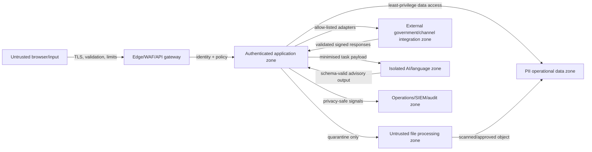
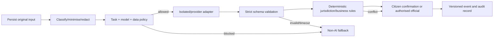

# 05 — Security, privacy, and AI governance

## Security posture

The prototype is a synthetic demonstration, but it should be engineered as a **credible precursor**, not labelled “secure” or “compliant” without evidence. Production conformance requires owner policies, independent audits, testing, and certification.

The control hierarchy is:

1. minimise sensitive data and authority;
2. enforce identity, object, function, and purpose controls server-side;
3. preserve an immutable business/audit history;
4. isolate untrusted files, providers, integrations, and AI;
5. make failures visible, recoverable, and reportable;
6. independently verify through tests and authorised audit.

## Applicable references and target posture

| Reference | What it contributes | POC treatment | Production treatment |
| --- | --- | --- | --- |
| GIGW 3.0 | Quality, WCAG 2.1 AA, cybersecurity, lifecycle, safe-to-host expectation | Engineering checklist; no certification claim | Full conformity programme and CQW evidence |
| OWASP ASVS 5.0 | Verifiable web application security requirements | Use an ASVS-inspired checklist, prioritising auth/access/input/API/session/logging | Select formal verification level with assessor; maintain traceability |
| OWASP API Security Top 10 2023 | Object/function authorisation, resource limits, business flows, inventory, unsafe upstream APIs | API tests and gateway/handler controls | Continuous API inventory, testing, gateway policy, partner assurance |
| CERT-In 2022 directions | Time sync, six-hour incident reporting, PoC, 180-day in-India logs | Clock/correlation design and incident template | Mandatory operating process where applicable |
| DPDP Act 2023 and Rules 2025 | Security safeguards, processor contracts, accuracy, notice/rights/retention/breach duties as provisions commence | Synthetic data; design toward future obligations | Legal counsel/owner maps effective provisions, exemptions, duties, and notices |
| MeitY cloud requirements | Empanelment, India hosting/data processing, certifications, audit, portability, secure disposal | Not claimed for commercial demo host | Approved NIC/MeitY-empanelled environment and exit plan |
| CPGRAMS NextGen RFP | LLM isolation, encryption, audit, MFA, DR, security audit, quarterly security maintenance | External AI prohibited from real data | Meet the stricter stated LLM and platform controls |
| STQC WQCS | Manual/tool evaluation, backend process, VA, network, data-centre, security evidence | Prepare artefacts early | Independent evaluation/certification route |

OWASP ASVS provides a testable web-security control baseline, while the API Security Top 10 highlights object-level authorisation and unsafe upstream consumption. Sources: [OWASP ASVS](https://owasp.org/www-project-application-security-verification-standard/) and [OWASP API Security](https://owasp.org/www-project-api-security/).

## Trust boundaries

No boundary trusts browser roles, object IDs, file metadata, provider responses, or AI output.

## Data classification

| Class | Examples | POC | Production controls |
| --- | --- | --- | --- |
| Public | Published help, policy text, aggregate non-PII statistics | Normal web content | Integrity, provenance, cache invalidation, content owner |
| Internal | Route configuration drafts, runbooks, non-sensitive telemetry | Synthetic/local | Workforce identity, least privilege, version/change control |
| Confidential personal | Name/contact/address, grievance text, case history, feedback | **No real data permitted** | Purpose-bound access, encryption, masking, audit, retention, rights handling |
| Restricted/high-risk | Identity proofs, sensitive evidence, protected service details, credentials/keys | Not permitted | Segmented storage, strong MFA, HSM/KMS, strict need-to-know, monitored export |
| Security/audit | Access events, incident evidence, admin changes | Synthetic actor IDs | Append-only/independent store, 180-day minimum as applicable, India jurisdiction, restricted analysts |

Logs are not automatically “non-sensitive.” URLs, headers, query parameters, exception bodies, object keys, and model inputs can leak personal data. Logging libraries must use allow-listed fields and redaction tests.

## Identity, session, and authorisation

### POC

- Seeded fictional users with published judge credentials.
- Maintained authentication library; no home-grown crypto or session token format.
- Database-backed, revocable sessions; Secure/HttpOnly/SameSite cookies on HTTPS.
- Generic sign-in failure messages and rate limiting.
- Server-side ownership check for every case/draft/receipt/appeal operation.
- CSRF protection for cookie-authenticated writes.
- Return-to-resource after expiry through allow-listed same-origin paths.
- Test that same-tab, new-tab, refresh, direct-link, expiry, and revoked-session paths all behave consistently.

### Production

- Approved OIDC/OAuth2 identity federation and assurance level; citizen and official identity flows are distinct.
- MFA/step-up for officials, privileged actions, exports, and policy/configuration changes.
- Role/attribute/purpose-based authorisation: organisation, jurisdiction, assignment, case state, action, and delegation period.
- Separation of duties for route administration, case decision, appeal, audit, and platform administration.
- Just-in-time privileged access, approval, recording, and automatic expiry.
- Service workload identities and mutual TLS/service-policy where appropriate; no shared static passwords.
- Periodic access review and rapid revocation.

## Access-control invariants

- An authenticated user can read only cases linked to that identity or a documented delegated authority.
- A guessed case ID never changes the response in a way that confirms another person's case exists.
- Listing and search apply authorisation before pagination/counts/aggregates.
- An officer can act only for assigned jurisdiction and allowed states.
- Appeals are read by the appropriate appellate authority, not the original decision maker unless policy requires access.
- Admin UI hiding does not implement authorisation; every command checks policy server-side.
- All bulk export and support impersonation requires explicit purpose, approval, watermark, audit, and expiry.

## Input, API, and business-flow security

- Validate request body, parameters, headers, content type, size, array depth, and unknown fields against versioned schemas.
- Parameterised database queries only; ORM use is not a substitute for validation or least-privilege database roles.
- Output encoding and a restrictive Content Security Policy; avoid unsafe HTML rendering.
- Rate limits for sign-in, route assistance, case submission, public lookup, reminders, appeals, export, and file upload.
- Idempotency keys and uniqueness constraints prevent duplicate grievances/appeals after retries.
- Anti-automation controls are risk-based and accessible; do not force CAPTCHA on ordinary signed-in case access.
- Validate every upstream URL/host and prevent server-side request forgery; adapters use allow lists and controlled egress.
- Maintain a complete API and event inventory, including deprecated versions and test/admin endpoints.
- Apply timeouts, maximum retries with jitter, circuit breakers, and payload/schema verification to third-party APIs.

## File and document threat model

Arbitrary file upload is out of initial scope. Production requires:

1. upload to quarantine under a generated object key;
2. extension, magic-byte/media-signature, size, page, compression-ratio, and filename checks;
3. malware scanning in an isolated, non-privileged environment;
4. safe parsing/OCR with CPU, memory, time, and network limits;
5. content disarm/reconstruction where policy and fidelity allow;
6. approved object transition to the private evidence store;
7. audit event and user-visible processing status;
8. rejection that preserves the case draft and explains safe alternatives;
9. no inline active content execution and safe download headers;
10. retention/deletion tied to case and legal policy.

## Encryption and keys

### POC

- HTTPS only on the public deployment.
- Host/database provider encryption at rest, with synthetic data only.
- Secrets only in host/CI secret stores and local ignored environment files.
- No secret, session, provider response, or connection string in logs or client bundles.

### Production

- TLS for all external/internal traffic with approved protocols/ciphers and certificate automation.
- Encryption at rest for databases, objects, queues, backups, logs, and analytics zones.
- Government/customer-controlled KMS/HSM and separation of key administrators from data administrators.
- Per-environment keys, rotation, revocation, backup/recovery, and cryptographic inventory.
- Field/token-level protection for high-risk identifiers where query requirements allow.
- Keys and plaintext never enter application/AI logs; envelope encryption for sensitive objects.

## Audit trail versus observability

| Business/security audit | Observability |
| --- | --- |
| Who did what, to which case/configuration, when, under which role/purpose, and why | Whether services are healthy, fast, failing, saturated, or dependent on a broken integration |
| Append-only, retention-controlled, restricted, and evidence-oriented | Metrics, traces, and structured logs with privacy-safe identifiers |
| Citizen/official actions, route override, assignment, evidence access, closure, appeal, admin/policy changes, exports | Request count/latency/errors, queue lag, DB pool, cache, provider latency, retries, resource use |
| Corrected by compensating events, not editing history | Can be sampled/aggregated subject to incident and retention needs |

Use the same correlation ID to connect them, but never duplicate the complaint body into telemetry. An independent store/export and restricted access make audit history more credible than a table writable by the application administrator.

## AI governance

### Allowed POC uses

- language-aware route candidates;
- short, clearly labelled summary;
- clarification-question suggestions;
- comparison between synthetic requested outcomes and synthetic official actions for receipt drafting.

### Prohibited uses

- autonomous rejection, closure, priority reduction, eligibility/entitlement decision, legal conclusion, or appeal decision;
- altering/deleting the original statement;
- sending real citizen data or files to OpenAI or any non-approved external model;
- exposing chain-of-thought or treating explanations as proof of model reasoning;
- storing a model's output as official action without an authorised actor accepting it;
- using protected attributes or proxies to rank citizens.

### Control sequence

### Model/prompt registry

Record task name, provider/model deployment, prompt/template version, schema version, rule-catalogue version, evaluation-set version, release approval, and rollback target. Do not record raw production inputs in the registry.

### Evaluation gates

- labelled, approved data by language/category with privacy protection;
- top-1/top-k route usefulness plus citizen override rate;
- false scope-exclusion and high-impact error review;
- consistency across language and accessibility modes;
- schema validity, refusal, hallucinated-route, latency, and fallback rates;
- regression against deterministic baselines;
- human review before launch and after material model/prompt/rule change;
- continuous drift monitoring and kill-switch exercises.

## OpenAI-specific POC boundary

Official OpenAI documentation says standard API inputs/outputs are not used for model training by default, but default abuse-monitoring logs can be retained for up to 30 days, and the Responses API has application-state rules unless configured appropriately; approved Zero Data Retention is a separate programme. `store: false` reduces response application-state persistence but is not equivalent to the RFP's complete isolated-environment requirement.

Therefore:

- synthetic demo input only;
- `store: false`;
- no Conversations, vector stores, uploaded files, background mode, remote MCP, or hosted tools for complaint processing;
- provider request timeout, retry cap, rate/spend cap, and circuit breaker;
- no model content logging;
- production adapter is disabled until formal approval and architecture review.

Source: [official OpenAI data-controls documentation](https://developers.openai.com/api/docs/guides/your-data#default-usage-policies-by-endpoint).

## Privacy and DPDP readiness

This is architecture guidance, not legal advice. The notified 2025 commencement schedule is phased: some provisions/rules commenced on publication, another tranche is scheduled one year after publication, and a larger tranche eighteen months after publication. As of 24 August 2026, the full framework is not yet in force. Design toward the complete obligation set and have counsel/owner confirm effective provisions, government exemptions, and lawful basis before processing real data. Sources: [DPDP commencement notification](https://www.meity.gov.in/static/uploads/2025/11/c56ceae6c383460ca69577428d36828b.pdf) and [DPDP Rules 2025](https://www.meity.gov.in/static/uploads/2025/11/53450e6e5dc0bfa85ebd78686cadad39.pdf).

Production readiness includes:

- data inventory, flow maps, purpose/authority and owner for every field;
- standalone clear notice and language accessibility;
- collection minimisation and no unrelated analytics reuse;
- processor contracts and subprocessor approval;
- accuracy/completeness controls where data drives a decision/disclosure;
- technical/organisational safeguards and breach response;
- retention schedule, legal holds, archival, deletion, and deletion evidence;
- rights/grievance routes as applicable, with identity-safe handling;
- privacy impact/risk assessment for AI, documents, analytics, and cross-department exchange;
- no assumption that “government system” removes every privacy obligation.

## Threat register

| Threat | Impact | Primary controls | Verification |
| --- | --- | --- | --- |
| Broken object-level authorisation | Another citizen's case exposed/changed | Ownership policy in every repository/use case, opaque IDs, negative tests | Cross-account API/E2E tests; security review |
| Session/UI divergence | Dashboard looks signed in while server rejects actions | Server session validation, consistent expiry, recovery return path | Same/new-tab/expiry/revocation tests |
| Duplicate submission after retry | Duplicate grievance/appeal and citizen confusion | Idempotency key, uniqueness, replayed response | Failure/retry integration tests |
| Privileged officer misuse | Unauthorised view/action/export | MFA, jurisdiction/assignment ABAC, separation of duties, audit | Access review, scenario tests, audit sampling |
| File malware/parser exploit | Platform compromise/data leak | Quarantine, scanning, sandbox, limits, safe rendering | Malicious corpus, sandbox validation, pentest |
| Prompt injection in complaint/document | AI bypass or data exfiltration | Task-only model, no tools/egress, input separation, schema/rule validation | Adversarial evaluation; egress tests |
| Hallucinated route/closure | Delay or unfair outcome | Catalogue-constrained routes, citizen confirmation, human decision | Labelled evaluation; override monitoring |
| Upstream API compromise | Poisoned data/SSRF/credential loss | Allow-list, mTLS/OAuth, schema/signature checks, egress control, circuit breaker | Contract/security tests; rotation drill |
| Sensitive logs | Secondary breach | Allow-list logging, redaction, access controls, retention | Automated log-content tests and sampling |
| Ransomware/data loss | Service loss and corrupted records | Immutable/offline backups, replication, least privilege, restore drills | Scheduled restore and DR exercises |
| Supply-chain compromise | Malicious dependency/image | Lockfile, provenance, SBOM, SCA, signatures, minimal images | CI policy and deployment admission checks |
| Denial of service / resource exhaustion | Citizens cannot file/view | Edge protection, quotas, queue/backpressure, autoscaling, degradation | Load/stress/abuse tests |

## CERT-In operating requirements

The 2022 CERT-In directions require covered government organisations and other entities to:

- synchronise ICT clocks with NIC/NPL or traceable sources;
- report specified cyber incidents within six hours of notice;
- designate a CERT-In point of contact;
- enable ICT logs and retain them securely for a rolling 180 days within Indian jurisdiction.

Source: [CERT-In directions dated 28 April 2022](https://www.cert-in.org.in/PDF/CERT-In_Directions_70B_28.04.2022.pdf).

Production incident planning must therefore include a 24×7 detection/triage path, named decision authority, initial-notification template, evidence preservation, legal/privacy coordination, citizen communication, and post-incident correction. The six-hour report is an initial report requirement, not permission to delay containment until a full root cause is known.

## Security verification and certification path

1. Security/privacy requirements and traceability matrix at inception.
2. Architecture threat model and data-flow review before implementation.
3. Secure coding, review, SAST/SCA/secrets/IaC/container gates in CI.
4. Unit, integration, authorisation, abuse-case, file, AI, and contract tests.
5. DAST/API testing and authenticated penetration testing in staging.
6. Performance/load/stress and resilience testing.
7. Accessibility/manual GIGW evidence and Website Quality Manual/process artefacts.
8. Remediate and retest; document residual risk owner and expiry.
9. Independent CERT-In-empanelled security audit and STQC route before go-live.
10. Pilot sign-off, monitored rollout, quarterly preventive security audit/maintenance per the NextGen RFP, annual/surprise certification surveillance as applicable.

No logo, “safe to host,” GIGW, STQC, CERT-In, ISO, or WCAG conformance claim should appear until the corresponding evidence/authority exists.
