# 06 — DevSecOps, SRE, and operations

## Operating principle

Government-grade quality comes from repeatable evidence, not a diagram full of tools. Every release should be attributable, reproducible, tested, observable, reversible, and accompanied by the operational artefacts needed to run it.

The POC implements a lightweight version of this chain. The production target adds independent security/certification gates, infrastructure as code, environment promotion, SLO governance, and DR exercises.

## Environment model

| Environment | Data | Access | Purpose |
| --- | --- | --- | --- |
| Local | Generated synthetic fixtures | Developers | Fast coding, unit/integration tests |
| CI ephemeral | Fresh synthetic seed per job | CI workload identity | Tests, migrations, build, scans |
| Preview | Synthetic only; short lived | Team/reviewer | UI/PR review; no stable demo links |
| Demo | Curated synthetic judge accounts/cases | Public sign-in with published test credentials | Stable hackathon public URL |
| Development (future) | Approved synthetic/masked test data | Engineering | Integrated development |
| Test/UAT (future) | Approved representative test data | QA/UAT roles | Contract, accessibility, performance, business acceptance |
| Staging/pre-production (future) | Production-like, minimised/masked | Restricted | DAST, performance, resilience, migration, audit evidence |
| Production (future) | Authorised live data | Citizens/officials/operations | Official service |
| Near-DR/DR (future) | Encrypted replicated/backup live data | Restricted operations | Continuity and disaster exercises |

Never copy a production grievance database into development. Where representative data is essential, use an approved de-identification/synthetic process with re-identification risk review.

## Delivery pipeline

```mermaid
flowchart LR
    Change[Code/content/schema change]
    Review[Peer review + ADR/threat update]
    Fast[Format, lint, types, unit tests]
    Build[Reproducible build + migrations]
    Secure[SAST, SCA, secrets, SBOM, IaC/container scans]
    Test[Integration, contract, E2E, authorisation]
    UX[Accessibility + visual/responsive checks]
    Perf[Performance/resilience checks]
    Artifact[Signed immutable image/artifacts]
    Preview[Preview/demo deploy]
    Approve[Owner/UAT/security approval]
    Stage[Staging deploy + DAST/audit]
    Prod[Progressive production deploy]
    Observe[SLIs, errors, citizen journey, rollback]

    Change --> Review --> Fast --> Build --> Secure --> Test --> UX --> Perf --> Artifact
    Artifact --> Preview
    Preview --> Approve --> Stage --> Prod --> Observe
    Observe -.failure/error budget.-> Change
```

For the POC, `Approve → Stage → Prod` is replaced by a controlled demo deployment; it must not be called a government production release.

## Pull-request gates for the POC

### Code and schema

- formatting and linting;
- TypeScript strict type check;
- database migration lint/review and migrate-up test from an empty database;
- unit tests for domain state transitions and permissions;
- integration tests with a real ephemeral PostgreSQL instance;
- OpenAPI/schema generation and drift check;
- event-schema compatibility check;
- dead-code/demo-only route check in the public build.

### Security and supply chain

- secret scan of commits and build output;
- dependency vulnerability and licence inventory/review;
- SAST for server/browser code;
- generated SBOM for the container/application;
- container/base-image scan and non-root/minimal runtime check;
- lockfile integrity and lifecycle review for direct dependencies;
- environment-variable schema and no-secret-in-client-bundle test;
- authorisation negative tests across two seeded users;
- log-redaction tests using canary synthetic personal strings.

### Citizen journey

- E2E sign-in → draft → route → receipt → timeline → Resolution Receipt → appeal;
- refresh/new-tab/direct-link and reauthentication recovery;
- duplicate-click/retry/idempotency behaviour;
- AI timeout, malformed output, rate-limit, and disabled-provider fallback;
- notification outbox retry/idempotency;
- 320px, mobile, tablet, and desktop visual regression at key pages;
- keyboard navigation and visible focus;
- axe scan, labels, errors/status messages, language attributes;
- manual 200%/400% zoom and screen-reader smoke test before submission.

Playwright's accessibility guidance explicitly notes that automated scans find only some accessibility problems and should be combined with manual and inclusive testing. Source: [Playwright accessibility testing](https://playwright.dev/docs/next/accessibility-testing).

## Branching and release

- Protected `main` is always deployable.
- Short-lived feature branches/PRs; no long-running integration branch.
- Required review for domain, database, auth, AI, and deployment changes.
- Conventional, human-readable commit messages and linked issue/decision.
- Every demo release receives an immutable tag, source commit, migration set, SBOM, build digest, seed version, and short release note.
- Database changes are expand/contract when rolling compatibility matters; destructive migration requires an approved backup/rollback plan.
- Feature flags are owned, audited, default-safe, environment-specific, and have removal dates.

## Deployment strategy

### POC

1. CI builds and tests a multi-stage container or the host's reproducible Next.js artefact.
2. Database migration runs as an explicit release job, not concurrently from every app instance.
3. Seed/update script is idempotent and affects only known synthetic demo records.
4. Health/readiness checks verify process and critical dependency readiness separately.
5. Smoke tests run against the public URL using the judge account.
6. A previous known-good artefact and compatible migration rollback/forward-fix path are documented.

### Production target

- GitOps or an equivalent approved deployment control with reviewed infrastructure/config changes.
- Signed images, provenance/attestations, admission policy, non-root workloads, read-only filesystem where possible, resource limits, seccomp/security context, and network policies.
- Rolling/canary or blue-green deployment by service risk.
- Automatic halt/rollback on health, error-rate, latency, or journey-synthetic failure; database rollback is not assumed safe.
- Deployment windows and approvals reflect citizen impact; routine release does not require a service outage.
- Separate break-glass path with MFA, approval, time-bound access, and audit.

## Infrastructure as code and configuration

Production should store reviewed, versioned definitions for:

- network segments, ingress/egress, WAF/rate policy, private endpoints;
- Kubernetes/OpenShift namespaces, workloads, autoscaling, disruption budgets, network policy;
- databases, object storage, queues/brokers, backups, replicas, encryption, retention;
- identity/service roles and policy bindings;
- KMS/secrets, monitoring/alerts, SIEM feeds;
- DNS/failover, Near-DR/DR resources;
- dashboards, SLOs, synthetic journeys, runbook links.

Provider-specific modules remain isolated. Plan output is reviewed; drift detection alerts on console changes; importing emergency changes back to code is mandatory.

## Secrets management

- No secret in Git, container layers, screenshots, tickets, browser code, or logs.
- CI uses workload identity/short-lived credentials rather than permanent cloud keys where supported.
- Application receives secrets from an approved manager at runtime; rotation does not require a code rebuild.
- Separate credentials/keys by environment, service, and purpose.
- Database roles use least privilege; migration role is not the runtime role.
- Provider/API keys have network/use restrictions, budget/rate caps, owners, expiry/rotation, and revocation drills.
- Secret access is audited; break-glass access is separately monitored.

## Observability architecture

The NextGen RFP asks for OpenTelemetry alignment and an enterprise monitoring system. OpenTelemetry is vendor-neutral and correlates traces, metrics, and logs; JavaScript tracing/metrics support is available for Node.js. Sources: [OpenTelemetry documentation](https://opentelemetry.io/docs/) and [OpenTelemetry JavaScript](https://opentelemetry.io/docs/languages/js/).

### Required signals

| Layer | Metrics/signals |
| --- | --- |
| Citizen journey | start/completion/abandonment by step, recovery success, repeated-field count, route correction, receipt comprehension study results |
| HTTP/API | request rate, error code, latency, payload rejection, auth denial, idempotent replay |
| Case domain | transitions by type, stuck age, information-needed age, Resolution Receipt completeness, appeal creation |
| Routing/AI | availability, latency, schema-validity, confidence bands, override, rule conflicts, fallback, per-language evaluation |
| Database | connection pool, query latency, locks, replica lag, storage growth, failed migrations |
| Outbox/broker | pending age, delivery attempts, dead letters, consumer lag, duplicate suppression |
| Notification | accepted, provider response, delivered/failed where available, retry/fallback, opt-out |
| Document | quarantine age, scan result, parser failures, object access denials |
| Infrastructure | CPU/memory/restarts, saturation, node/zone health, ingress/WAF, certificate expiry |
| Security | suspicious auth/access patterns, privilege changes, export, secret/KMS use, WAF/IDS/SIEM incidents |

### Correlation and privacy

- Generate/propagate W3C trace context and a user-visible incident/reference code.
- Correlation IDs are random and do not encode case ID, phone, email, or identity.
- Use stable privacy-safe route names in metrics, never complaint text or arbitrary labels with high cardinality.
- Sample normal traces but retain required security/audit records under their own policy.
- Redact headers, cookies, tokens, URL parameters, SQL values, provider inputs/outputs, and object URLs by default.
- Operational dashboards link to owned runbooks and show data freshness.

## SLO and alert design

Alerts should be actionable and based on user impact or impending exhaustion—not every individual exception.

| Condition | Alert level | First action |
| --- | --- | --- |
| Grievance submissions not durably accepted | Page | Disable optional AI, verify DB/outbox, preserve idempotent retries |
| Signed-in list works but case detail fails | Page | Treat as P0 continuity regression; run cross-route auth synthetic |
| Error-budget burn for core read/write journeys | Page/ticket by burn rate | Halt releases; diagnose dependency/service |
| AI unavailable/high latency | Ticket or low-urgency page if fallback also fails | Open circuit; use manual route catalogue |
| Outbox oldest age above threshold | Page | Check worker/provider; prevent duplicate replay |
| Replica/backup/restore failure | Page | Protect RPO; investigate and execute backup runbook |
| Certificate/key/secret expiry approaching | Ticket well in advance | Rotate through rehearsed process |
| Security anomaly or data leak indicator | Security page/incident | Contain, preserve evidence, invoke CERT-In/privacy process |
| Accessibility synthetic/critical control regression | Release blocker | Roll back or fix; do not defer a blocked citizen path |

## Runbook set

At minimum:

- citizen cannot sign in;
- dashboard/case-detail authorisation divergence;
- grievance submit timeout/duplicate retry;
- database unavailable/slow/connection exhaustion;
- route-assist provider down or producing invalid output;
- Bhashini/language service down;
- notification provider failure and channel fallback;
- object-storage/document-scanner failure;
- queue/outbox backlog/dead letter replay;
- suspected broken object authorisation/data exposure;
- leaked secret/credential rotation;
- ransomware/data corruption;
- backup restore and point-in-time recovery;
- Near-DR/DR failover and failback;
- bad deployment/feature flag/migration;
- CERT-In six-hour reporting workflow;
- accessibility-critical regression;
- public status/communications and citizen support handoff.

Each runbook names owner/on-call, symptoms, dashboards, safe diagnostic queries, containment, decision authority, recovery, validation, communication, escalation, and post-incident follow-up.

## Backup, restore, and DR operations

Backups are not complete until restore is proven.

- Encrypted database point-in-time recovery plus scheduled full/base backups.
- Versioned/immutable object protection and independently protected configuration/audit backups.
- Backup catalogue with owner, scope, frequency, retention, encryption key, replica/offline location, and last restore result.
- Automated backup success alerts plus regular sampled restores in an isolated environment.
- Quarterly or owner-approved DR exercise covering traffic switch, data verification, dependencies, queues, identity, secrets, communications, and failback.
- Validate case/event counts, last committed events, object hashes, and citizen synthetic journeys after restore/failover.
- Track achieved RPO/RTO, not only configured values.
- Prevent compromised production credentials from deleting all backups.

## Capacity and performance engineering

- Establish a baseline from representative journey tests, not one homepage benchmark.
- Model read-heavy status/timeline traffic separately from case submission, documents, analytics, and AI.
- Test peak, spike, soak, failover, dependency slowdown, retry storm, bulk integration replay, and large allowed attachments.
- Define graceful degradation: static/help and case filing/view remain available when AI, analytics, search, or noncritical channels fail.
- Use bounded pools, queues, retries, and concurrency; unlimited autoscaling can amplify database/provider failure and cost.
- Review data/index growth at least quarterly and before campaign/policy changes.
- Maintain a performance budget for page weight, third-party code, fonts, images, and client JavaScript.

## Operational roles

| Role | Responsibility |
| --- | --- |
| Product/service owner | Outcomes, priority, citizen impact, acceptance |
| Web Information Manager/content owner | GIGW lifecycle, content accuracy, language, policies |
| Engineering owner | Architecture, delivery, reliability, code/data contracts |
| SRE/operations | SLOs, on-call, capacity, deployment, backup/DR |
| Security/SOC | controls, monitoring, incident response, audit coordination |
| Privacy/legal | data purpose, notices, retention, rights, breach obligations |
| Accessibility lead/testers | conformance evidence, manual/inclusive testing, regression gate |
| Grievance-policy/routing owner | taxonomy, jurisdiction, SLAs, official actions, appeals |
| AI/model owner | approved tasks/models, evaluation, drift, rollback, misuse monitoring |
| Integration owner | partner contracts, credentials, schema/version, incidents |

No production deployment should leave these responsibilities implicitly with “the developer.”

## Evidence pack for a later audit/write-up

- architecture and data-flow diagrams;
- ADRs and threat model;
- software/data/API/event inventory;
- requirements-to-test traceability matrix;
- Website Quality Manual and GIGW/WCAG evidence;
- network and deployment architecture;
- data classification, retention, processor/integration register;
- secure-development policy, code-review and training evidence;
- SBOM, dependency/licence reports, build provenance;
- VA/SAST/SCA/DAST/API/pentest and remediation reports;
- performance/load/stress/resilience results;
- backup/restore and DR exercise results;
- SLO/incident/change/access review reports;
- AI model card, task/evaluation data, approval and rollback records;
- UAT, pilot, training, support, and go-live sign-offs.
