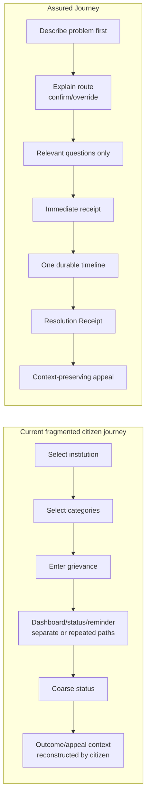

# 07 — Product design system and current-vs-proposed experience

> This document defines the original product comparison. The finalized cross-government research, Indian visual language, responsive rules, accessibility architecture and implementation decisions are in [10 — Inclusive civic design architecture](10-inclusive-civic-design-architecture.md).

## Design objective

Create a restrained, trustworthy government-service experience that a busy or distressed citizen can complete on a small screen, keyboard, or assistive technology—without needing to understand departmental structure.

The POC must not impersonate an official government deployment. It should state that it is an unofficial hackathon demonstration with synthetic data, avoid misuse of the State Emblem/official seals, and use a distinct project identity while applying government-grade interaction standards.

## The change is structural, not cosmetic



## Current versus proposed

| Journey element | Current evidence/baseline | Proposed experience | Why it is better | Measure |
| --- | --- | --- | --- | --- |
| Entry | Ministry/department and category before complaint | Describe the problem first | Citizen need precedes government structure | Time to route; completion without help |
| Routing | Structured dropdowns have operational value but place burden on citizen | Suggest + explain + show uncertainty + citizen confirm/search/override | Preserves jurisdiction while reducing guesswork | Correction rate; top-k usefulness; zero silent rejection |
| Scope exclusions | Policy list and declaration; specialised portals | Actionable explanation and exact handoff pattern | “Not here” becomes a next step | Handoff completion |
| Language | Page switch and separate voice chatbot; user reported locked/misdetected language | Separate UI/input/reply preferences, change anytime | One wrong detection does not derail filing | Mid-draft switch success; language comprehension |
| Session | Visible timer but recovery/authorisation diverged in audit | Warning, extend, autosave, reauth back to record | Keeps the security control without losing work | Recovery success; zero lost draft |
| Acknowledgement | Pending state, uncertain notification/next event | Immediate receipt, route, next checkpoint, notification preview | Creates assurance without fake promise of instant human action | Citizen can identify owner/state/next step |
| Status | Coarse status and fragmented endpoints | Plain-language state plus append-only timeline | Shows progress, request, document, action, and delay | Timeline completeness; support queries |
| Signed-in access | Status page may repeat registration/contact/CAPTCHA | “My grievances” opens directly | Removes redundant entry and accessible-CAPTCHA burden | Repeated-field count = 0 |
| Closure | Status/action text may require interpretation | Resolution Receipt maps each request to action/evidence/gap | Makes resolution quality inspectable | Receipt comprehension; unresolved-item detection |
| Appeal | Citizen may need to reconstruct case/context | Select disputed items; context and evidence prefilled | Lowers appeal effort and loss of evidence | Appeal preparation time; repeated upload count |
| Errors | Generic 403/“something went wrong” observed | Cause-specific recovery, safe retry, incident ID, preserved return path | Turns dead ends into recoverable states | Recovery without re-entry |
| Mobile | Existing app/UMANG already cover mobile channel | Responsive browser experience and shared state model | Judges can open it; no duplicate mobile product | Full 320px journey |

## Visual and interaction language

### Character

- Calm, plain, direct, and administrative without feeling bureaucratic.
- Minimal surfaces and one clear primary action per step.
- No glassmorphism, neon, 3D, decorative dashboards, oversized waveform, or gradient-heavy visual effects.
- Status communicated by words, icons, and structure—not colour alone.
- Dense evidence is organised in progressive disclosure, not hidden from the citizen.

### Foundations

Use UX4G Design System 3.0 tokens and patterns as the starting point:

- semantic colour roles: page, surface, text, muted text, border, primary action, focus, success, warning, critical, information;
- type scale with Noto Sans/appropriate Noto Indic coverage and robust fallbacks;
- base-4 spacing scale and responsive grid;
- visible focus style and minimum target sizing;
- restrained elevation only for real hierarchy;
- consistent icons with text labels for important actions;
- plain-language and multilingual message catalogues.

Do not hard-code a public-service brand palette before checking contrast in all states. Do not assume a UX4G component is conformant after import; test the rendered combination. Sources: [UX4G foundations](https://www.ux4g.gov.in/foundations) and [UX4G components](https://www.ux4g.gov.in/components).

## Information architecture

```text
Public
├── About this demo / privacy / accessibility / help
├── Sign in with test account
└── Service status (demo)

Signed in
├── My grievances
│   ├── Active
│   ├── Needs your action
│   └── Outcome / appeal available
├── Start a grievance
│   ├── Describe
│   ├── Confirm route
│   ├── Relevant details and evidence
│   └── Review and submit
├── Case
│   ├── Receipt and current state
│   ├── Timeline
│   ├── Messages/information requests
│   ├── Evidence
│   ├── Resolution Receipt
│   └── Appeal
└── Preferences
    ├── Interface/input/reply language
    ├── Notification preference (simulated)
    └── Session/sign out
```

“My grievances” is the authenticated status surface. A separate anonymous registration-number form can exist in a future system but is not routed into the signed-in journey.

## Key page blueprints

### 1. My grievances

```text
┌──────────────────────────────────────────────────────────────────┐
│ CPGRAMS Assured Journey — unofficial synthetic demo             │
│ My grievances                                      [Start new]  │
├──────────────────────────────────────────────────────────────────┤
│ Needs your action (1)                                             │
│ ┌ Case BWMI/2026/000104 ─ Information needed ─ due 27 Aug ─────┐ │
│ │ Mobile service activation and billing                        │ │
│ │ Department/unit • last update • next action                  │ │
│ │ [Open case]                                                   │ │
│ └───────────────────────────────────────────────────────────────┘ │
│ Active (1)                                                        │
│ ┌ Case BWMI/2026/000103 ─ Action in progress ──────────────────┐ │
│ │ Next expected checkpoint • service target                    │ │
│ │ [Open case]                                                   │ │
│ └───────────────────────────────────────────────────────────────┘ │
└──────────────────────────────────────────────────────────────────┘
```

Cards are not a decorative grid. They are a compact list with a strong text hierarchy, one link target, and no hidden hover-only action.

### 2. Describe-first intake

```text
Start a grievance                         Step 1 of 4: Describe
──────────────────────────────────────────────────────────────────
Tell us what happened and what outcome you need.

Your language        [Hindi ▼]     Preferred reply [Hindi ▼]

What happened? *
┌────────────────────────────────────────────────────────────────┐
│ [multiline text]                                               │
└────────────────────────────────────────────────────────────────┘
Original wording will be preserved.       Saved just now

What would make this right? *
┌────────────────────────────────────────────────────────────────┐
│ Add outcome                                                     │
└────────────────────────────────────────────────────────────────┘

[Save and exit]                                  [Help me route →]
```

Voice is an optional secondary button with a clear recording state, transcript review, language override, and text fallback. It is not the visual centre of the page.

### 3. Route confirmation

```text
Step 2 of 4: Confirm where this should go
──────────────────────────────────────────────────────────────────
Suggested route                                                MEDIUM
Telecommunications → Mobile services → Activation and billing

Why: Your description mentions a mobile connection and an incorrect bill.
This is a suggestion. You control the route.

[Confirm this route]  [See 2 other possibilities]  [Search routes]

Not a CPGRAMS matter? We will explain the boundary and exact next service;
we will not reject the grievance automatically.
```

Never present five nearly identical choices without examples. Use at most two or three high-value alternatives, then search/browse.

### 4. Immediate receipt

```text
Grievance received                                  ✓
BWMI/2026/000104                  Filed 24 Aug 2026, 14:42 IST
──────────────────────────────────────────────────────────────────
Where it is going     Telecommunications / Mobile services
Current state         Received
Next checkpoint       Routing check
Service expectation   We will show each action here; no need to re-enter ID

Statement             [Show original]
Requested outcomes    2
Evidence               1 safe sample document
Notification           Email/SMS simulation queued ✓

[Open case timeline] [Download/print receipt] [Return to my grievances]
```

### 5. Case timeline

```text
BWMI/2026/000104        Action in progress            Next: outcome
──────────────────────────────────────────────────────────────────
● 24 Aug 14:42  Received
│                 Receipt issued; route confirmed by citizen
● 24 Aug 14:43  Routing checked
│                 Rule catalogue v3; no change
● 24 Aug 15:05  Assigned
│                 Fictional Telecom Consumer Services Unit
● 25 Aug 10:20  Action in progress
│                 Evidence under review
○ Next             Outcome and Resolution Receipt

[Original statement] [Evidence] [Notification history]
```

The timeline is a semantic ordered list. State changes are not represented only by a visual line.

### 6. Resolution Receipt

```text
Resolution Receipt v1                  Outcome posted 26 Aug 2026
──────────────────────────────────────────────────────────────────
Requested outcome 1: Activate the service
Official action: Service activated on 26 Aug
Evidence: Activation confirmation.pdf
Result: RESOLVED

Requested outcome 2: Remove incorrect fee
Official action: Fee review initiated; no reversal posted
Evidence: Billing review note.pdf
Result: PARTLY RESOLVED
Unresolved gap: Final corrected bill is not available.

Reason for closure: [plain-language official/mock explanation]

Did this resolve your problem? [Yes] [Partly] [No]
[Appeal unresolved item]     Appeal deadline/explanation
```

Requested outcomes, official actions, proof, and gaps are parallel rows so the citizen can compare them. The page must not hide the unresolved part below a celebratory “success” banner.

### 7. Context-preserving appeal

```text
Appeal case BWMI/2026/000104
──────────────────────────────────────────────────────────────────
Disputed item (prefilled)
☑ Incorrect fee has not been reversed

Already attached
• Original statement
• Submitted evidence
• Resolution Receipt v1
• Billing review note

Why are you appealing? *
[multiline field; saved draft]

[Save draft]                              [Review appeal →]
```

The citizen can add grounds/evidence but is not asked to reconstruct the case.

## Component inventory

| Pattern/component | Requirements |
| --- | --- |
| Government/demo header | Unofficial demo status, service name, language, help, signed-in identity; no misleading official seal |
| Step indicator | Text “Step X of Y,” ordered list semantics, current step announced |
| Autosave status | `aria-live` status, no constant chatter, timestamp/details on request |
| Language control | UI/input/reply language clearly separated; change without reset |
| Text area/outcome builder | Persistent label/instructions, character guidance if real limit, error linked to field |
| Route suggestion | Suggestion label, confidence band explained, reason, alternatives, override |
| Scope handoff | Reason, right service, exact next action, what carries over, safe external-link warning |
| Receipt summary | Registration ID, timestamp, route, state, next event, notification, print/download |
| Timeline | Ordered events with actor class, action, time, reason/evidence; current/next state |
| Resolution comparison | One row per requested outcome, action, proof, result, gap |
| Appeal builder | Prefilled disputed items and inherited record; accessible selection and confirmation |
| Session warning | Modal/dialog only when necessary, announced remaining time, extend/save-sign-out |
| Error/recovery | Specific cause class, preserved context, safe retry/reauth, incident ID, support link |
| Notification history | Channel, event, accepted/delivered/failed simulation, time; no destination exposure |

## Content design

- Use the citizen's words before institutional terminology.
- One instruction per sentence where possible.
- Expand acronyms the first time; do not expect knowledge of GRO, ATR, nodal authority, or jurisdiction.
- Name the actor and next event: “Telecom Consumer Services Unit is reviewing your evidence,” not “Under process.”
- Distinguish received, assigned, action, outcome, closure, and appeal.
- Do not say “resolved successfully” when any requested item is unresolved.
- Explain uncertainty: “This looks most likely to be…” rather than false certainty.
- Explain why data/document is requested and whether it is required.
- Machine translation and AI summaries are labelled, with original text one action away.
- Dates use unambiguous format plus IST; relative time is supplementary.
- Errors never blame the citizen and never discard work.

## Accessibility specification

- GIGW 3.0/WCAG 2.1 AA is the required government baseline; engineer to WCAG 2.2 AA where compatible.
- Semantic landmarks, headings, native form controls, labels, descriptions, and error associations.
- Status changes announced without moving focus unexpectedly.
- Focus order follows the visual order; focus returns deliberately after dialogs and route changes.
- No keyboard trap, hover-only content, drag-only action, or time-limited field without adjustment.
- Minimum target size and spacing; visible focus not obscured by sticky headers.
- Contrast checked for every state in context, not only token values.
- 320 CSS px reflow, portrait/landscape, 200% and 400% zoom as applicable.
- Correct `lang` on page and translated parts; Indic text remains selectable real text.
- Captions/transcripts for any demo video/audio; voice has text alternative.
- CAPTCHA is absent from ordinary signed-in access; future public lookup requires an accessible, risk-based alternative.
- Session extension and accessible authentication avoid memory/cognitive puzzles.

## Responsive behaviour

| Width/context | Behaviour |
| --- | --- |
| Small phone / 320px | One column, bottom-safe actions, no side navigation, metadata wraps, receipt comparison stacks with persistent row headings |
| Large phone/tablet | One main column with optional summary panel below/above, not side-by-side dependence |
| Desktop | Main content at readable line length; secondary case summary/timeline navigation may be sticky if it never obscures focus/content |
| Print/PDF | Clear service/demo identity, case/receipt version, requested/action/evidence/gap, page numbers; interactive-only controls removed |
| Slow/unstable network | HTML/content and saved draft first; AI/notification enhancements progressively load and fail independently |

## Interaction rules

- One primary action per step; back/save are distinct secondary actions.
- Destructive/irreversible actions require review/confirmation; POC does not expose real deletion.
- Submit buttons become pending but idempotent retries remain possible.
- Preserve inputs on validation, network, AI, and session failures.
- Use skeletons only for predictable content and accompany them with accessible status; do not show a fake encryption/loading ceremony.
- Motion is optional, brief, and respects reduced-motion preferences.
- Deep links to authorised cases must work in same/new tab; navigation does not depend on hidden tab state.

## Design QA and measurable proof

| Claim | Evidence to collect |
| --- | --- |
| Less institutional burden | Time/clicks to confirmed route; citizen can begin without department knowledge |
| No repeated signed-in identity | Field inventory across dashboard/case/receipt/appeal |
| Better assurance | Users correctly identify owner, state, next event, and expected action |
| Better resolution transparency | Users distinguish resolved/partly/unresolved items and supporting proof |
| Faster appeal | Time and repeated fields/uploads versus baseline journey |
| Accessible | Automated report plus keyboard, screen-reader, zoom/reflow, language test records |
| Resilient | Same/new-tab, refresh, offline/retry, AI-down, and expiry recovery tests |
| Trustworthy AI | Users distinguish original text, AI suggestion/summary, deterministic rule, and official/mock action |

## What not to build into the visual design

- A second official-looking clone with government emblem and misleading `gov.in` styling.
- A generic chatbot home page.
- A dashboard full of charts that judges cannot use as a citizen.
- A voice avatar or animated waveform as the main interaction.
- Status represented only as coloured badges.
- An “AI confidence 87%” number unless it is genuinely calibrated and explained.
- A celebration screen that hides unresolved outcomes.
- Long policy text before the citizen can explain the problem.
- Desktop-first fixed width or “best viewed at” assumptions.
