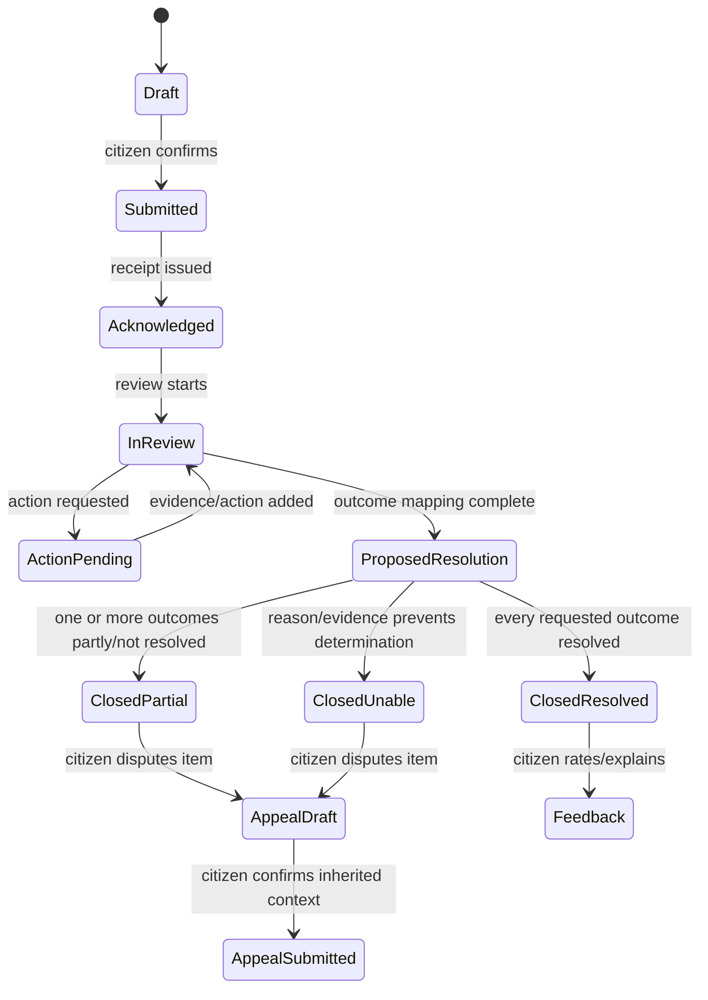
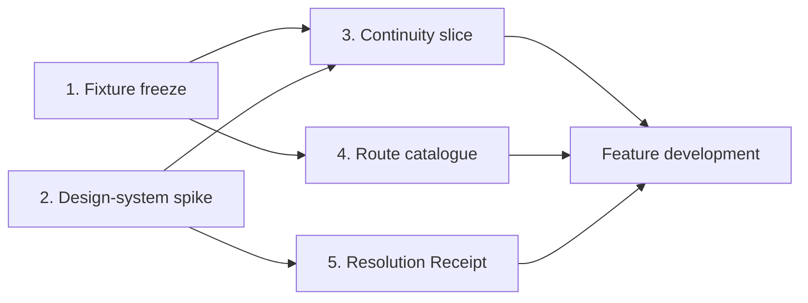

# 09 — Finalized development gates

Status: decisions frozen for initial implementation
Decision date: 24 August 2026
Scope: synthetic, browser-first hackathon proof of concept

These gates are now concrete product decisions rather than open research questions. A gate may expose an implementation problem and force a technical adjustment, but the team should not reopen the selected CPGRAMS problem or replace the assured-lifecycle concept unless evidence invalidates the core journey.

## Gate summary

| Gate | Final decision | Blocking exit evidence |
| --- | --- | --- |
| 1. Judge journey | One fictional telecommunications case with two requested outcomes and a partly successful closure | Versioned fixture renders end to end in English and Hindi |
| 2. Design-system spike | UX4G tokens and patterns; project-owned semantic components when library behaviour is uncertain | Critical component page passes keyboard, zoom/reflow, contrast, language, and screen-reader checks |
| 3. Session continuity | Database-backed session, server-side ownership checks, stable case URLs, autosave and return-after-reauth | Same/new-tab/direct-link/refresh/reauth work; cross-account access is denied |
| 4. Routing evaluation | Four-area fictional catalogue and 48 labelled synthetic inputs | Strict schema and manual fallback pass; no in-scope input is automatically excluded |
| 5. Resolution Receipt | Versioned outcome/action/evidence/gap contract with item-level appeal inheritance | Partial outcome cannot display as blanket success; appeal preserves exact context |

## Gate 1 — Frozen judge story and publication-safe fixture

### Fictional citizen

- display name: **Asha Verma**;
- account type: seeded citizen demonstration account;
- preferred language: Hindi, with an English switch available on the same step;
- device story: budget Android phone on an intermittent mobile connection;
- accessibility story: large text and touch use must work; the journey must also be keyboard and screen-reader operable;
- privacy status: entirely fictional, with no phone number, email address, location, case number, or attachment copied from a real person.

The interface must display `Synthetic demonstration data` and `Unofficial hackathon prototype` in persistent, non-alarming text. It must not use the State Emblem, CPGRAMS logo, an official seal, or production domain styling that could mislead a reviewer.

### Complaint

**Fictional scenario:** Asha paid a ₹499 service-activation charge. The mobile service still shows as inactive. A previous support request has not corrected the service or fee.

The original statement contains two explicit requested outcomes:

1. activate the mobile service;
2. reverse the ₹499 charge if the activation was not completed on the promised date.

This is a useful judge story because it is understandable without specialist knowledge, demonstrates multi-outcome tracking, fits the already inspected telecommunications branch, and makes a partial resolution credible.

### Fictional route

```text
Service area: Telecommunications
Category: Mobile services
Issue: Activation and billing
Mock route code: TEL-MOB-ACT-BILL
```

This route is part of the project's fictional catalogue. It must never be described as the live CPGRAMS routing code or production department hierarchy.

### Evidence fixture

- `activation-receipt.pdf`: a generated, clearly watermarked fictional payment receipt;
- `support-ticket.txt`: a fictional chronology with no provider branding or real identifier;
- safe metadata: file name, MIME type, byte size, generated timestamp, malware-scan simulation state, and content hash;
- no live upload is required for the primary demo—the safe fixture is selected from bundled sample evidence.

### Route interaction

The advisory AI returns up to three candidates using a strict schema. For the main story it returns the telecommunications route with medium confidence and a plain-language reason. The citizen must see:

- the original text unchanged;
- `Suggested route`, not `Assigned department`;
- the reason for the suggestion;
- `Use this route` and `Choose another route`;
- a searchable manual route path;
- no confidence percentage in the consumer UI because it creates false precision.

The demo must also contain an AI-disabled switch for the presenter. With AI disabled, the citizen uses search/browse and completes the identical journey.

### Timeline fixture

| Order | Event | Citizen-facing meaning |
| --- | --- | --- |
| 1 | Grievance submitted | Received once with a stable reference and timestamp |
| 2 | Route confirmed | Telecommunications → Mobile services → Activation and billing |
| 3 | Review started | A fictional grievance officer is reviewing the two requested outcomes |
| 4 | Action recorded | Service activation was completed; charge review remains open |
| 5 | Resolution Receipt issued | Outcome 1 resolved; outcome 2 partly resolved/unresolved |
| 6 | Appeal draft created | Only the disputed fee item is selected and prior context is inherited |

### Main closure fixture

| Requested outcome | Mock action | Evidence | Result | Gap |
| --- | --- | --- | --- | --- |
| Activate service | Activation instruction completed | Fictional activation confirmation | Resolved | None |
| Reverse ₹499 charge | Charge reviewed but no reversal recorded | Fictional billing-note reference | Partly resolved | Refund decision/evidence missing |

### Gate 1 exit criteria

- The entire fixture is stored as version-controlled seed data and explicitly marked synthetic.
- English and Hindi original statements and interface content are authored separately; one is not browser machine translation of the other.
- The same case supports dashboard, timeline, Resolution Receipt, feedback, and appeal.
- There is no real brand, personal contact, registration ID, screenshot, complaint text, or production endpoint.
- Resetting the demo produces the same deterministic starting state.

## Gate 2 — UX4G, accessibility, and design-system spike

### Final adoption decision

Adopt UX4G at three levels:

1. **Foundations:** spacing, typography principles, colour roles, focus, responsive grid, content and accessibility guidance.
2. **Patterns:** progressive disclosure, clear feedback, mobile-first tasks, multilingual parity, dashboards, status and notifications.
3. **Components:** use a UX4G component only after it passes the project's Next.js and accessibility spike.

The project does not depend on the entire component library. Native semantic HTML wrapped by project-owned React components is the fallback. This prevents a library defect or hydration problem from blocking the citizen journey.

### Spike page

Build `/design-lab/critical-components` behind the demo environment flag with:

- skip link, service header, language switch and synthetic-data notice;
- breadcrumb or back link;
- one page heading and short lead text;
- text input, textarea, radio group, checkbox and file/sample-evidence selector;
- hint, required/optional text, inline error and top error summary;
- route suggestion card with confirm and override actions;
- status alert using `role=status` only where a live announcement is needed;
- step indicator;
- session-warning dialog with extend/sign-in choices;
- compact timeline item;
- primary, secondary and text-link actions;
- loading, empty, unavailable and permission-denied states.

### Standards target

- Formal India baseline: GIGW 3.0 and WCAG 2.1 AA.
- Project engineering target: WCAG 2.2 AA where it does not conflict with the formal baseline.
- Project touch target: at least 44 × 44 CSS pixels for primary actions; WCAG 2.2's smaller minimum is not treated as the design goal.
- Body text: 1rem minimum with user-controlled browser scaling; never lock text in pixels.
- Core journey: usable at 320 CSS pixels and at 400% zoom without two-dimensional scrolling.

### Component pass matrix

| Area | Pass condition |
| --- | --- |
| Semantics | Native element/landmark first; names, roles, states, descriptions and heading order are correct |
| Keyboard | Logical tab order, visible focus, no trap, Escape closes only dismissible layers, Enter/Space match native behaviour |
| Screen reader | NVDA plus Chrome/Firefox and at least one mobile screen reader can identify labels, errors, step changes and status updates |
| Reflow | 320px and 400% zoom preserve content/action order with no clipped control or hidden focus |
| Language | English/Hindi switch keeps the user on the same step and updates `lang`; labels may wrap without overlap |
| Contrast | Text, controls, focus, status and disabled boundaries pass in their actual states/backgrounds |
| Motion | No essential animation; reduced-motion preference removes non-essential transition |
| Failure | Core form remains understandable and submittable when enhancement JavaScript or AI is unavailable |
| Performance | Critical route stays inside the approved route-level JavaScript, font and total transfer budgets |

### Rejection rules

Reject or wrap a UX4G component if it:

- changes context on focus or selection without confirmation;
- requires pointer/drag/hover for essential operation;
- cannot expose a useful native name, role, state or error association;
- loses content at 320px, 200% text or 400% zoom;
- prevents server-rendered fallback or causes hydration instability;
- creates a duplicate accessibility toolbar instead of solving underlying semantics;
- has an undocumented accessibility limitation without a usable alternative.

### Gate 2 exit criteria

- No critical axe violations and no unreviewed serious violations.
- Recorded manual keyboard, zoom/reflow, contrast and screen-reader results.
- Hindi and English screenshots at compact and wide widths.
- A component adoption table records `adopt`, `wrap`, `replace`, or `defer`, with reasons.
- Accessibility overlay/toolkit controls are not presented as proof of conformance.

## Gate 3 — Session, direct-link, and recovery continuity

### Final session design

- Better Auth database-backed sessions for the POC.
- Secure, HTTP-only session cookie; `SameSite=Lax`; `Secure` in hosted environments.
- Thirty-minute idle window for the demonstration, with a warning five minutes before expiry.
- `Continue session` performs a server-confirmed extension; it is not a client-only timer reset.
- Draft grievance autosaves after meaningful changes and before timeout.
- If expiry occurs, sign-in returns to the intended authorised case/draft URL.
- Absolute duration, production assurance level and reauthentication rules remain owner-controlled production decisions.

### Stable navigation contract

```text
/grievances                         citizen's authorised list
/grievances/new                     draft intake
/grievances/{opaqueCaseId}          authorised case overview
/grievances/{opaqueCaseId}/receipt  versioned Resolution Receipt
/grievances/{opaqueCaseId}/appeal   inherited appeal draft
```

Every request performs server-side subject/object/function authorisation. A registration number, URL, hidden field or front-end filter is never treated as authorisation. Case identifiers are opaque and non-sequential.

### Required test identities

- `citizen.asha@example.test`: owns the primary synthetic grievance;
- `citizen.ravi@example.test`: owns a separate fixture and must be denied access to Asha's case;
- `judge@example.test`: optional guided demo account that receives a deterministic publication-safe state;
- no admin experience is required or exposed to judges.

### Test sequence

1. sign in as Asha;
2. open `My grievances` and the primary case;
3. refresh and use browser back/forward;
4. open the same URL in a new tab;
5. paste the direct URL into a clean signed-in tab;
6. begin an appeal, navigate away, and return to the preserved draft;
7. expire the session and sign back in;
8. confirm return to the exact authorised resource with no repeated case/contact/CAPTCHA fields;
9. sign in as Ravi and attempt Asha's URLs and API calls;
10. verify a generic safe denial with no case existence/details leaked;
11. replay a submit request and verify idempotency prevents duplicate cases/events.

### Gate 3 exit criteria

- All navigation paths succeed for the owner and fail safely for another citizen.
- Authenticated status/reminder/timeline paths never ask for registration number, contact detail or CAPTCHA again.
- Timeout warning is keyboard/screen-reader operable and does not obscure focus.
- Draft and intended route recover after reauthentication.
- Security logs record actor, object class, result and correlation ID without grievance text or contact data.

## Gate 4 — Frozen route catalogue and evaluation contract

### Fictional catalogue

The first version contains four service areas already recognisable from the inspected public routing surface. All route codes and examples are project fixtures.

| Area | Mock categories |
| --- | --- |
| Telecommunications | activation and billing; connectivity/service quality; number portability/account service |
| Financial services — banking | account/service access; transaction dispute; fee or charge issue |
| Labour and employment | provident-fund service; wage/employment programme issue; portal/registration service |
| Posts | delayed or lost article; delivery/service complaint; postal financial service |

### Scope handoffs

The catalogue includes deterministic handoff guidance for:

- RTI requests;
- court/sub-judice matters;
- religious matters;
- pension grievances that use the dedicated path;
- government employee service matters before prescribed channels are exhausted;
- emergencies or threats requiring an emergency channel.

These are explanations and handoffs, not silent rejection. An ambiguous input must remain eligible for citizen review or manual help.

### Evaluation set

Freeze 48 publication-safe labelled inputs:

- 8 clear in-scope inputs for each of the four areas: 32;
- 8 ambiguous or multi-issue inputs;
- 8 out-of-scope/handoff inputs;
- language distribution: 20 English, 16 Hindi and 12 Hinglish/mixed-script;
- within the set: missing detail, spelling variation, colloquial language, copied boilerplate, adversarial instructions and more than one requested outcome.

Each record contains original text, language, allowed route candidates, handoff status, requested outcomes, expected clarification, rationale and reviewer notes. AI output never overwrites these labels.

### AI response contract

```json
{
  "language": "hi|en|mixed|unknown",
  "summary": "labelled assistant summary",
  "requestedOutcomes": ["..."],
  "candidates": [
    {
      "routeCode": "TEL-MOB-ACT-BILL",
      "reason": "plain-language explanation",
      "confidenceBand": "high|medium|low"
    }
  ],
  "needsClarification": true,
  "clarifyingQuestion": "one answerable question or null",
  "handoff": { "kind": "none|information|urgent", "reason": "..." }
}
```

Reject provider output containing an unknown route code, extra action, autonomous eligibility/closure instruction, embedded HTML, or a schema violation. Fall back to manual search without losing the original text.

### Gate thresholds

| Metric | Gate threshold | Why |
| --- | --- | --- |
| Schema-valid responses | 100% after adapter validation/retry; otherwise fallback | Invalid model output cannot reach case logic |
| Manual fallback completion | 100% across the 48 fixtures | AI must never be the only route |
| Autonomous reject/close decisions | 0 | Outside the permitted AI role |
| False scope exclusion | 0 of the 40 in-scope/ambiguous inputs | Wrong rejection is higher harm than asking for review |
| Top-3 allowed-route usefulness | ≥90% overall | Candidate assistance is more important than false top-1 certainty |
| Top-1 allowed route | ≥75% overall | Useful POC threshold, not a production claim |
| Language disparity | Review any >10 percentage-point gap; do not hide aggregate differences | Aggregate accuracy can conceal Hindi/mixed-language failures |
| Adapter timeout | 5 seconds, then manual fallback | Busy citizens cannot wait on a decorative dependency |

The write-up must report sample size and per-language counts. It must call results `synthetic fixture performance`, never `production accuracy`.

### Gate 4 exit criteria

- Taxonomy and all 48 inputs are versioned.
- Two human reviews agree on every handoff and main-story route.
- The AI-disabled run completes every fixture manually.
- No input is dropped, silently rewritten or rejected by the model.
- Evaluation command produces a deterministic JSON/Markdown report suitable for the submission evidence.

## Gate 5 — Frozen Resolution Receipt and appeal contract

### Purpose

The Resolution Receipt answers the question that a coarse `Closed` status cannot:

> For each thing I asked for, what was done, what proves it, what remains unresolved, and what can I do next?

### Receipt schema

| Section | Required content |
| --- | --- |
| Identity | case reference, receipt version, issue time, current route, responsible unit label |
| Source | link to immutable original grievance and separately labelled assistant summary/translation |
| Outcome comparison | one row/card per requested outcome |
| Action | actor class, action, completion time and plain-language reason |
| Evidence | relied-upon document/action reference with safe preview/download state |
| Result | resolved, partly resolved, not resolved, or unable to determine—always text plus icon |
| Gap | missing action/evidence or reason the requested outcome was not met |
| Next step | feedback, clarification or appeal eligibility and time information |
| Integrity | receipt version and event reference; future production signature/verification adapter |

### Citizen state model



Internal routing states may be more detailed, but the citizen UI must use this small, stable vocabulary. A timestamped event explains every transition.

### Outcome item contract

```text
Requested outcome
What the department did
Evidence used
Result
What is still missing / reason
What you can do next
```

Desktop may present a comparison table, but the semantic source order is outcome-by-outcome and becomes stacked cards at compact widths. Colour is supplemental; every result has visible text and a distinct icon.

### Appeal inheritance

An appeal draft must inherit and lock references to:

- original grievance version;
- confirmed route;
- submitted evidence manifest;
- exact Resolution Receipt version;
- disputed requested-outcome IDs;
- action/evidence/gap for those items;
- citizen's new appeal reason and any new fictional evidence.

The citizen does not retype the complaint or re-upload existing evidence. They can unselect an item, add clarification, and review the complete appeal before the simulated submission.

### Gate 5 exit criteria

- A closure cannot be marked `ClosedResolved` while any requested outcome is partial, unresolved or undetermined.
- The main fixture visibly separates the resolved activation from the unresolved fee reversal.
- Every official/mock claim links to evidence or clearly says evidence is missing.
- Screen readers encounter outcome, action, evidence, result, gap and next step in that order.
- Print/PDF view preserves headings, URLs/references and result text without depending on colour.
- Appeal begins from a disputed receipt item and retains the complete context.
- Versions are immutable after issue; a correction creates a new version and event.

## Gate execution order



Gates 1 and 2 start together. Gate 3 becomes the first real vertical slice. Gate 4 can proceed alongside the non-AI form work. Gate 5 must be complete before polishing the chatbot or expanding categories.

## Final go/no-go rule

Development may expand beyond the foundation only when:

- the synthetic fixture and design-spike decisions are versioned;
- the owner/non-owner continuity tests pass;
- the manual route path is complete without AI;
- the Resolution Receipt can represent partial resolution honestly;
- no real citizen data, private audit image or production integration is present.

If time becomes constrained, reduce route breadth, voice, dashboards and animation. Do not remove session continuity, the immediate receipt, outcome-level resolution, manual routing or context-preserving appeal.
