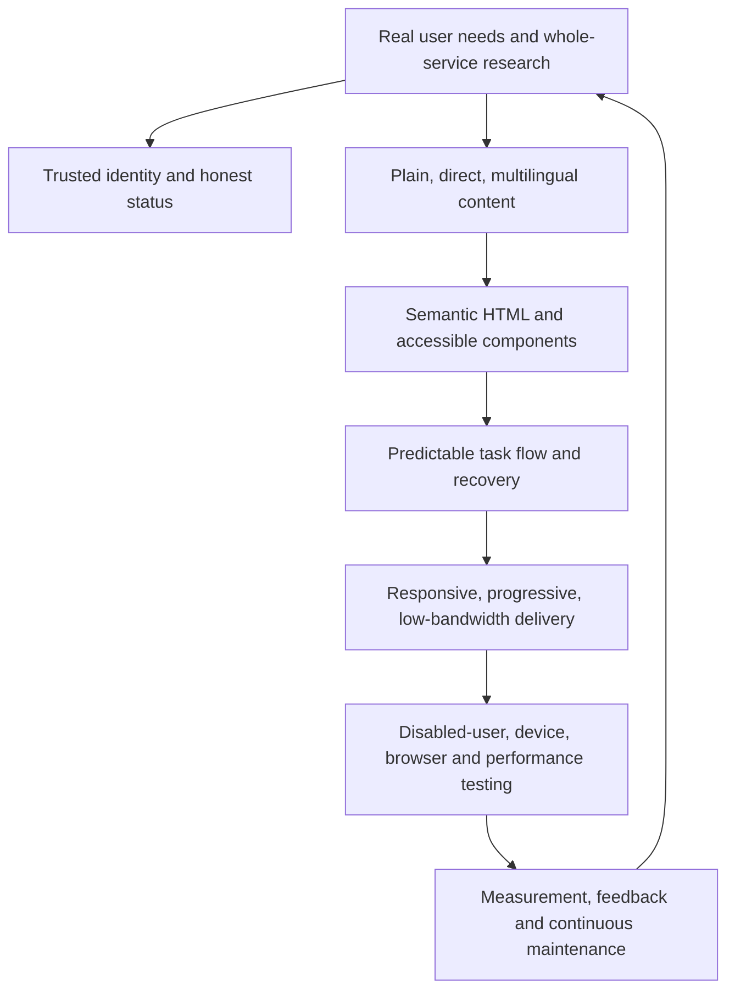
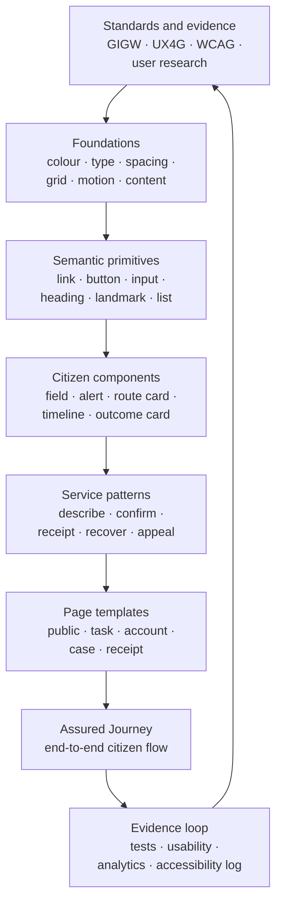
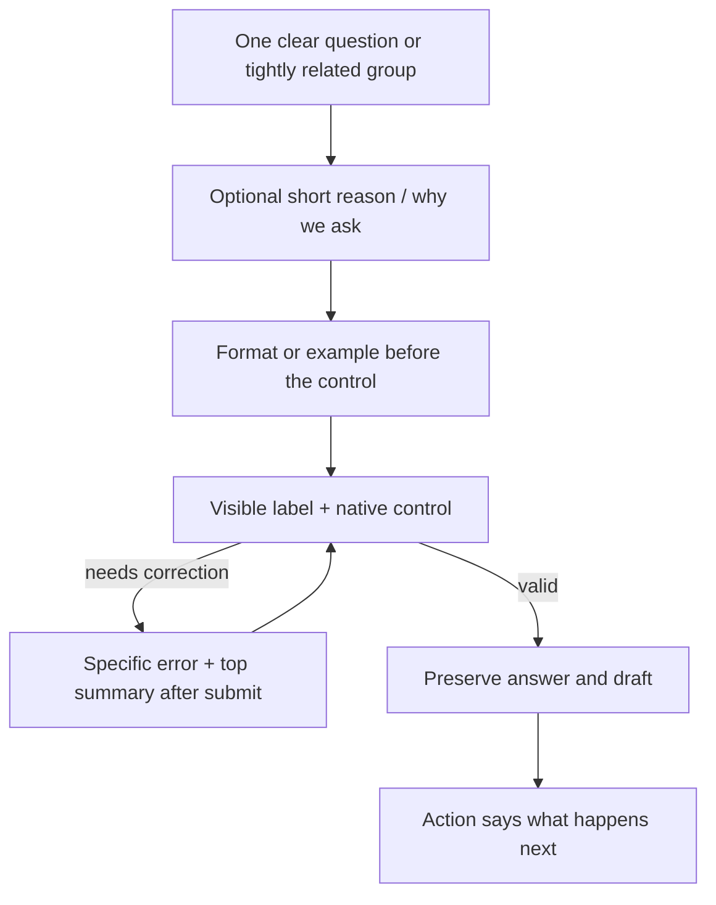

# 10 — Inclusive civic design architecture

Status: design direction selected; implementation tokens and components require in-context validation
Decision date: 24 August 2026
Working design direction: **Indian Civic Calm**

## Executive decision

Build a calm, task-first public-service interface whose Indian identity comes from language support, typography, civic colour and content—not ornamental nationalism or visual spectacle.

The experience should feel:

- trustworthy without pretending this prototype is official;
- Indian without depending on one region, religion, class, age group or aesthetic taste;
- contemporary without fashion-led glass, gradients, 3D scenes, animated avatars or excessive rounding;
- accessible through its structure, code, language, recovery and testing—not through an overlay;
- equivalent across phone, tablet and desktop, while allowing layouts to differ;
- resilient on low-powered devices and unreliable connections;
- clear to a first-time or stressed citizen who does not know government structure.

## Research scope and claim discipline

It is not credible to claim that every Indian or international government website was manually audited. This plan uses:

1. India's official GIGW 3.0 conformity matrix, UX4G Design System and STQC certification material;
2. the private, read-only CPGRAMS citizen-journey audit already completed for this project;
3. official design systems and service standards from the United States, United Kingdom, Canada, Australia, Singapore, New Zealand and the European Commission;
4. W3C WCAG 2.2 and internationalisation guidance;
5. implementation proposals that are explicitly labelled as project decisions.

The comparison is therefore evidence-led and representative, not a ranking of whole countries or a claim that every agency follows its own standard perfectly.

## What other governments consistently do well

| System | Official baseline or emphasis | Transferable lesson |
| --- | --- | --- |
| India — GIGW 3.0 / UX4G | Usability, user-centricity, universal accessibility; WCAG 2.1 AA; bilingual/Unicode; lifecycle ownership; reusable tokens, components and patterns | India already has a strong standard. The opportunity is disciplined implementation, page-level testing and lifecycle governance |
| United States — USWDS | Real user needs, earned trust, accessibility, continuity, device responsiveness, listening; tested accessible components | Treat trust and accessibility as continuous product work, not a one-time checklist |
| United Kingdom — GOV.UK | WCAG 2.2 AA, progressive enhancement, one clear task, plain language, strong form/error patterns, assisted digital support | HTML-first resilience and extremely clear content outperform decorative complexity |
| Canada — GC Design System / WET | Recognisable trusted brand, bilingual English/French component parity, responsive technology-neutral components | Global shell consistency can coexist with task-specific body layouts and multilingual delivery |
| Australia — Digital Service Standard / GOLD | Inclusive end-to-end service, evidence over opinion, function over fashion, consistent not uniform, open reusable components | The system should standardise proven basics while allowing evidence-backed service-specific patterns |
| Singapore — SGDS | Fast, accessible, mobile-friendly shared foundations; direct respectful content; explicit component anatomy and accessibility notes | Every label, hint, error and state is part of the design system, not filler written after coding |
| New Zealand — Web Standards | WCAG 2.2 AA for complete pages/processes, usability standard, self-assessment/risk plans and alternate formats | Conformance applies to the entire process, and known gaps require visible ownership and plans |
| European Commission — ECL | User-centred, standardised vocabulary, consistency, reusability, flexibility and inclusive design | A shared vocabulary and maintained components reduce cognitive and organisational fragmentation |

## Common international pattern



Across these systems, the most consistent design principles are:

1. start with the user's task, not the department chart;
2. reuse an official/shared design language before inventing components;
3. use plain language and visible labels;
4. make the core journey linear, predictable and recoverable;
5. support keyboard, screen reader, touch, zoom, language and low bandwidth by default;
6. treat errors, timeouts, help, offline behaviour and assisted channels as normal states;
7. maintain equivalent functionality across devices, not pixel-identical layouts;
8. test complete journeys with real people and assistive technology;
9. publish or record accessibility status and known limitations;
10. govern the design system as a maintained product.

## India's real gap

The gap is **not** the absence of design guidance. GIGW 3.0 covers content, lifecycle, consistency, bilingual delivery, accessibility, security and certification. UX4G supplies modern tokens, components and patterns. STQC provides an evaluation route.

The evidence-backed problem is uneven execution across services and across time:

- legacy pages can remain dense, desktop-oriented or visually inconsistent;
- ministry/department structures are exposed before the citizen describes the task;
- authenticated context is not always preserved across dashboard, status, reminder or assistant surfaces;
- accessibility toolbars can coexist with underlying semantic, focus or form problems;
- language changes can be partial, disruptive or separate from the current task state;
- validation can ask the citizen to understand rules instead of helping them correct the specific field;
- mobile layouts can technically shrink while retaining desktop information density;
- external chatbot/app windows can fragment identity and journey continuity;
- a status such as `Closed` can communicate less than the citizen needs to judge the outcome;
- certification or a component library can be mistaken for continuous page/process conformance.

For CPGRAMS specifically, this project has a dated official RFP baseline and a private 2026 read-only audit. We should describe findings as `documented in 2024`, `observed in the private audit`, or `proposed`; never generalise them to every Indian government service.

## Design north star

> A citizen can understand where they are, what is being asked, why it is needed, what happened, and what they can do next—on any supported device, with or without assistive technology, without knowing government structure.

### Seven design principles

#### 1. Function is the aesthetic

The first visual impression should be order, calm and competence. White space, typography, alignment and immediate feedback create beauty without decoration.

#### 2. One citizen journey, not a collection of endpoints

Dashboard, status, timeline, receipt and appeal share the same shell, identity and case context. New tabs, refresh and reauthentication must not feel like entering another portal.

#### 3. Indian by inclusion

Indian identity is expressed through Noto typography for Indic scripts, Unicode, unambiguous dates/amounts, Hindi/English parity, a restrained civic palette and familiar plain language. Avoid region-specific ornaments, religious motifs, stock photographs or visual stereotypes.

#### 4. Explain before requiring

Every unusual question explains why it is needed. Every exclusion gives a route forward. Every AI suggestion is labelled, explained and reversible.

#### 5. Preserve effort

Autosave meaningful work, keep values after errors, avoid redundant entry, preserve context through appeal, and return after sign-in or interruption.

#### 6. Accessibility is a system property

Accessibility must exist in research, tokens, components, content, state management, testing, issue severity and release gates. No overlay can repair an inaccessible process.

#### 7. Evidence beats taste

Every exception to UX4G or this plan requires a documented user need and test evidence. Visual novelty is not a reason.

## Design-system architecture



### Ownership boundaries

| Layer | Owner | Change rule |
| --- | --- | --- |
| Standards/evidence | product, accessibility and policy reviewers | Link every mandatory rule to a source and review date |
| Tokens | design-system owner | No one-off colour/spacing/type value in feature code |
| Primitives | frontend/accessibility owner | Native semantics first; ARIA requires a documented need |
| Components | design + frontend | Every state, language, keyboard path and failure mode documented |
| Patterns | product/content/design | Must solve a recurring user problem and include research notes |
| Templates | service team | May arrange patterns but cannot bypass token/component contracts |
| Journey | multidisciplinary team | Tested end to end, including offline/manual/appeal and assisted paths |

## Indian Civic Calm visual language

### Palette

The palette uses deep civic blue/indigo as the primary interaction colour, warm paper-like neutrals for calm, and restrained saffron/green accents. The tricolour is never spread across every button or status.

| Token | Proposed value | Use | Reason |
| --- | --- | --- | --- |
| `brand-civic-900` | `#173A63` | service header, high-emphasis text, print headings | Echoes Ashoka Chakra indigo without copying an official brand; white contrast ≈11.5:1 |
| `brand-civic-700` | `#1E4E8C` | primary action, selected control, links where tested | Calm and familiar; white contrast ≈8.3:1 |
| `brand-saffron-700` | `#A84F00` | thin civic accent, illustration detail, non-semantic highlight | Indian warmth; limited use prevents warning/status ambiguity; white contrast ≈5.6:1 |
| `semantic-success-700` | `#156B45` | success text/icon/border plus visible label | Green is reserved for completed/success meaning; white contrast ≈6.5:1 |
| `semantic-error-700` | `#B42318` | errors with text/icon and field connection | Distinct, high-contrast error role; never colour alone |
| `semantic-warning-800` | `#8A5A00` | warning text/icon/border | Dark enough for text and separate from decorative saffron by role/context |
| `focus-700` | `#005FCC` | dual focus ring | Visible on white and warm surfaces; use a contrasting inner/outer boundary on dark surfaces |
| `ink-950` | `#1B1F24` | body and heading text | High legibility; white contrast ≈16.6:1 |
| `ink-700` | `#475467` | secondary text | Remains readable; white contrast ≈7.7:1 |
| `canvas-warm` | `#F7F4ED` | quiet page background | Suggests public paper/document warmth without texture or noise |
| `surface` | `#FFFFFF` | forms, receipts, content surfaces | Maximum clarity and predictable printing |
| `border` | `#D5DCE5` | grouping boundary only | Structure without heavy boxes; never used as the only control boundary if contrast fails |

These ratios are initial calculations, not a conformance claim. Every real state, overlay, focus ring, hover, disabled condition and adjacent colour must be retested in code.

### Colour rules

- Neutral surfaces should occupy roughly 85–90% of the interface.
- Civic blue is the only default interactive colour.
- Saffron is decorative/identity accent, not the primary CTA and not error/warning shorthand.
- Green is semantic success, not general brand decoration.
- Status always has visible text and, where useful, an icon or pattern.
- Links remain visibly underlined in body content; colour alone is insufficient.
- Do not offer a colour-filter accessibility widget as a substitute for correct contrast.
- Respect operating-system forced colours and high-contrast modes.

### Typography

| Role | Decision | Reason |
| --- | --- | --- |
| Latin/English | Noto Sans variable or carefully subset Noto Sans | Pairs consistently with Indic Noto families and avoids novelty |
| Hindi | Noto Sans Devanagari | Official UX4G direction and strong Indic-script coverage |
| Future scripts | Matching Noto Sans family loaded per active language | Prevents downloading every Indian script while preserving parity |
| Base size | `1rem`, expected browser default 16px | Respects user settings and supports rem-based scaling |
| Body line height | 1.55–1.65 depending on script | Devanagari marks and long civic text need breathing room |
| Measure | 45–70 characters; forms usually ≤40rem | Reduces scanning and cognitive load |
| Heading style | sentence case, no all-caps paragraphs | Faster reading and friendlier screen-reader pronunciation |
| Reference numbers | tabular numerals or monospace only for the copyable value | Distinguishes identifiers without making the interface technical |

Do not use text inside images. Do not reduce Hindi text to make a translation fit a component; let the component grow. Load fonts from the application origin with appropriate caching and fallbacks.

### Spacing, shape and elevation

- 4px base token scale, with primary rhythm at 8, 12, 16, 24, 32 and 48px.
- Minimum 16px separation between unrelated form groups and 24–32px between page sections.
- Moderate 6–10px radii. Avoid pill-shaped form fields and overly playful cards.
- Borders and spacing create hierarchy; shadows are reserved for dialogs/temporary elevation.
- Every clickable target is at least 44 × 44 CSS pixels unless it is an inline text link with sufficient surrounding separation.
- Content width, not screen width, determines the number of columns.

### Indian motif rules

Allowed:

- a 2–3px restrained saffron/ivory/green civic thread in the shell, paired with a blue service marker;
- abstract line geometry inspired by public records, postal routes or the Ashoka Chakra's radial order in non-interactive empty/print states;
- warm off-white surfaces and high-quality Indic typography;
- bilingual identity and Indian date/amount formatting.

Not allowed:

- National Emblem, real ministry seal, CPGRAMS logo or official wordmark in the unofficial prototype;
- flag animation, waving cloth, monuments, politicians, religious motifs or regional costume as decoration;
- patterned backgrounds behind forms or text;
- gradients, glassmorphism, neon, 3D scenes, parallax, auto-playing media or ornamental chatbot avatars;
- an Indian theme that reduces readability or implies government endorsement.

## Page shell

### Persistent regions

```text
Skip to main content
────────────────────────────────────────────────────────
Unofficial prototype · Synthetic demonstration data
[Service name]                         [हिन्दी / English]
────────────────────────────────────────────────────────
Back / breadcrumb (only when useful)

Main: one H1, concise lead, current task/state

Help and accessibility contact (consistent position)
Privacy · Accessibility · Feedback · Prototype limitations
```

Rules:

- keep the global header to two calm rows maximum;
- do not reproduce the current portal's multi-row departmental navigation;
- language control is visible on every page and retains the current route/state;
- signed-in identity and `Sign out` are available but not visually dominant;
- avoid a sticky header on compact screens; if any element is sticky, prove it never obscures focus/content at 200–400% zoom;
- footer contains only useful policy/help links, version/build status and prototype disclaimer.

## Layout and responsive architecture

### Content-driven breakpoints

| Mode | Approximate range | Layout |
| --- | --- | --- |
| Compact | 20–40rem | Single column, full-width actions, compact header, stacked outcome cards |
| Medium | 40–64rem | Single primary column with wider reading measure; selected secondary items may sit beside each other |
| Wide | 64–80rem+ | Primary task stays constrained; supporting help/timeline summary may occupy a secondary column after it in source order |

Breakpoints use `rem`, not device-brand assumptions. The minimum engineering viewport is 320 CSS pixels. At 1280px viewport and 400% zoom, the service must reflow as a compact layout.

### Responsive invariants

- Same content, actions, status and help are available in every mode.
- DOM/source order follows the logical compact reading order.
- No essential horizontal scrolling. Genuine data tables may use a labelled scroll region plus an outcome-card alternative.
- Primary action follows the content it confirms; it does not float away from form context.
- No hover-only information or interaction.
- Orientation changes preserve entered data and current step.
- Browser back/forward are supported and do not duplicate submission.
- Direct URLs resolve to the same authorised case state.
- Long Hindi labels, 200% text and user font substitution may wrap without collision.

### Target viewport/device matrix for the POC

| Viewport/device class | Required check |
| --- | --- |
| 320 × 568 CSS px | smallest supported compact flow and 400% zoom equivalent |
| 360 × 800 / 390 × 844 | common budget/mainstream Android and iPhone compact flows |
| 768 × 1024 | tablet portrait/landscape |
| 1024 × 768 | small laptop and 200% zoom behaviour |
| 1280 × 720 / 1440 × 900 | judge laptop and wide layout restraint |

Pixel-perfect similarity is not required. Task completion and information equivalence are.

## Progressive enhancement and low-bandwidth design

The critical path must render on the server and use normal URLs/forms. JavaScript enhances autosave, route assistance, inline status and optimistic feedback; it must not be the only way to describe, route, submit, view or appeal.

### Failure hierarchy

1. HTML: labels, fields, content, submit, receipt and links work.
2. CSS: improves hierarchy and responsive layout.
3. JavaScript: adds autosave, session warning, dynamic route suggestion and richer status.
4. AI: adds advisory summary/candidates only.

If level 4 fails, manual routing works. If enhancement JavaScript fails, server submission/review works. Network retries use idempotency and preserve citizen-entered data.

### Proposed performance budget

| Budget | Critical citizen route target |
| --- | --- |
| Total first-load transfer | ≤450KB compressed, excluding user/sample evidence download |
| Route JavaScript | ≤200KB compressed |
| CSS | ≤45KB compressed |
| Active-language fonts | ≤120KB compressed through subsetting/language split where practical |
| Above-fold imagery | ≤80KB; normally no hero photograph |
| Third-party client scripts | zero on critical form route unless explicitly reviewed |

Production field goals at the 75th percentile, measured separately for mobile and desktop:

- LCP ≤2.5 seconds;
- INP ≤200 milliseconds;
- CLS ≤0.1.

The POC also runs throttled Lighthouse and an intermittent-network manual test. A large visual asset never outranks successful form recovery.

## Inclusive interaction architecture

### Barriers the design must handle

| Barrier | Design response |
| --- | --- |
| Blind/screen-reader use | landmarks, native controls, useful names, ordered headings, live status restraint, descriptive evidence links |
| Low vision/zoom | rem units, strong contrast, reflow, no clipped text, visible focus, forced-colour support |
| Colour vision difference | text/icon/pattern in addition to colour; grayscale test |
| Motor impairment | 44px targets, keyboard operation, no drag-only action, forgiving time limits, no precision gesture |
| Deaf/hard of hearing | text equivalent for every audio/voice response; voice never required |
| Cognitive/learning difference | one clear task, familiar words, predictable layout, short chunks, examples, visible progress and recovery |
| Dyslexia/reading stress | calm measure/spacing, no justified text, clear hierarchy, plain content and no animated distraction |
| Older citizen | large targets/text, stable placement, simple authentication, explicit outcome/next step |
| Low digital confidence | explain why, preview before submit, reversible choices, human/help path, no unexplained jargon |
| Hindi-first/mixed language | same-step switch, Unicode, script-appropriate font/spacing, human-reviewed critical content |
| Low bandwidth/low-end device | server HTML, minimal JavaScript/assets, no hero media, autosave, idempotent retry |
| Shared/public device | visible sign-out, no sensitive text in URL/title/log, safe session expiry and clear local-data behaviour |
| Interrupted/stressed use | draft persistence, session warning, return to exact step, no redundant entry |

### Semantic and focus contract

- Exactly one meaningful H1 per page.
- Use `header`, `nav`, `main`, `aside` and `footer` only for real landmarks.
- Skip link is first focusable item.
- Source order matches compact reading/task order.
- Use native `button`, `a`, `input`, `textarea`, `select`, `fieldset` and `legend` before custom roles.
- Never put a clickable element inside another clickable element.
- Every route/page updates the document title and places focus at the new page heading or error summary as appropriate.
- Dynamic status uses `role=status`/polite live region only when the update would otherwise be missed.
- Urgent alert is rare; do not make routine autosave announcements interrupt screen-reader speech.
- Dialogs are limited to true modal decisions such as impending session expiry; focus is trapped, labelled, restored and dismissible where safe.

### Forms



Rules:

- One main question per step when cognitive cost is high; group only genuinely related short fields.
- Labels remain visible; placeholders are examples, never labels.
- Mark optional fields as `Optional`; do not depend only on asterisks.
- Explain format before input and accept reasonable variations.
- Use `autocomplete` and correct input modes; identifiers/phone references remain text, not numeric spinners.
- Validate primarily on continue/submit. Avoid premature red/green feedback while the citizen is typing unless evidence proves it helps.
- Error summary receives focus, links to fields and uses the same specific message as the field.
- Never clear a valid or invalid value after error.
- Show a review page before irreversible submission and allow changes by section.
- Submission is idempotent and the button changes to a truthful pending state without removing its accessible name.

### Error and recovery language

An error must state:

1. what happened;
2. which information/action is affected;
3. how to fix it or what alternative exists;
4. whether entered work is safe.

Examples:

| Weak | Selected pattern |
| --- | --- |
| `Invalid input` | `Enter the date you first contacted the service.` |
| `Something went wrong` | `We could not check the suggested route. Your description is saved. Choose a route manually or try again.` |
| `Session expired` | `Your session ended to protect your account. Your draft is saved. Sign in to continue from this step.` |
| `Not allowed` | `You cannot open this grievance from this account. Return to My grievances or sign in with another account.` |

Avoid blame, humour, codes, `Oops`, `please note`, unexplained acronyms and promises the system cannot prove.

## Multilingual architecture

### POC language decision

- English and Hindi are complete first-class interface languages for the end-to-end judge journey.
- The switch is always visible and uses the language's own name: `English` and `हिन्दी`.
- Switching keeps route, draft, scroll/focus intent and entered content.
- Original citizen text is never auto-translated in place. Translation/summary is separate and labelled.
- Critical safety, privacy, error, receipt and appeal content is human-reviewed in both languages.

### Technical contract

- UTF-8 across HTML, JSON, forms, database and exports.
- BCP 47 language metadata on documents and language-specific spans.
- Store original, translation, language, direction, translation source/version and reviewer status separately.
- Components support at least 50% text expansion and multi-line actions without truncation.
- Use ICU message syntax for plural, select, date and number rules; do not concatenate sentence fragments.
- Use locale-aware dates/numbers but display critical dates unambiguously (`24 August 2026` / reviewed Hindi equivalent).
- Future Urdu/RTL support changes document direction with `dir`, mirrors directional layout/icons where meaningful and does not rely on CSS visual reordering.
- No image contains translatable instruction text.

### Translation parity gate

Every release compares translation keys and journey states. A page cannot silently fall back to English for a critical action without a visible, reviewed fallback rule. Updates to multi-language pages must be synchronised, matching GIGW lifecycle intent.

## Content architecture

### Voice

Clear, direct, respectful and purposeful. Address the citizen as `you` in English and with culturally respectful equivalent Hindi. Use active voice and sentence case.

### Content rules

- Lead with the task/current state, not ministry history.
- Use words citizens use; expand CPGRAMS/GRO/ATR on first use or replace them.
- Keep most sentences below roughly 20–25 words where translation permits.
- One idea per paragraph; lists for three or more related items.
- Buttons use a verb plus outcome: `Continue`, `Use this route`, `Submit grievance`, `Create appeal draft`.
- Links make sense out of context and identify file type/size where relevant.
- Do not use directional copy such as `on the right`.
- Do not describe a task as `easy`, `quick` or `simple`; prove it.
- Legal/policy text gets a short plain-language explanation plus the authoritative source.
- Receipt and status use actor, action, time, evidence and next step rather than vague administrative phrasing.

## Core component inventory

### Foundations/primitives

- skip link;
- service/prototype banner;
- header and language switch;
- back link/breadcrumb;
- heading, paragraph, list, descriptive link;
- button variants and button group;
- input, textarea, select, radio, checkbox, fieldset/legend;
- hint, error, error summary;
- alert/status;
- details/disclosure;
- dialog;
- table and responsive outcome-card alternative;
- visually hidden text and live region.

### Product components

| Component | Purpose | Essential states |
| --- | --- | --- |
| `JourneyStep` | Shows current step without implying navigation to inaccessible steps | current, complete, upcoming; text equivalent |
| `DraftStatus` | Calm autosave/recovery feedback | saving, saved, offline, failed with retry |
| `RouteSuggestion` | Explainable AI/manual candidate | suggested, selected, overridden, unavailable |
| `RequestedOutcomeEditor` | Converts desired result into explicit items | empty, item added, edit, validation |
| `EvidenceItem` | Safe sample/file metadata and status | selected, scanning, approved, rejected with reason |
| `SubmissionReceipt` | Immediate assurance | accepted, duplicate-retry recovered, notification simulated |
| `CaseTimeline` | Append-only citizen history | event, action needed, delayed, system unavailable |
| `OutcomeComparison` | Resolution Receipt item | resolved, partial, unresolved, undetermined |
| `AppealContext` | Shows inherited disputed material | locked source context, selectable disputed item, new reason |
| `SessionWarning` | Protects session without losing work | countdown, extend pending, expired/recover |

Each component documentation records anatomy, semantics, content constraints, responsive behaviour, keyboard interaction, screen-reader expectation, language expansion, errors, no-JavaScript fallback, test IDs and known limitations.

## Journey page decisions

### 1. Sign in

- Use seeded instant credentials for judges and an obvious `Use demo account` action.
- Allow paste and password managers; no cognitive puzzle/CAPTCHA in the POC.
- Explain synthetic account and timeout before entry.
- Hide irrelevant registration/account-management complexity.

### 2. My grievances

- One clear `Describe a new grievance` action.
- Cases show issue summary, current state, last meaningful update, owner/unit and next action.
- Avoid dashboard chart clutter; the citizen needs tasks and cases, not analytics.

### 3. Describe grievance

- Start with the problem and requested outcomes, not department/category.
- Use one generous textarea with visible guidance and character count only if there is a real limit.
- Let citizen add two or more requested outcomes as plain statements.
- Autosave and show quiet status.

### 4. Confirm route

- Present one recommended route and up to two alternatives.
- Explain why, clearly label AI assistance and retain original text.
- `Choose another route` remains equally reachable.
- Only after confirmation reveal route-specific questions/evidence guidance.

### 5. Review and submit

- Group summary by description, requested outcomes, route, answers and evidence.
- Every section has a direct `Change` link returning to preserved state.
- State what happens next and what notification is simulated.

### 6. Immediate receipt and timeline

- Show stable reference, submitted time, confirmed route, current state and next expected checkpoint above the fold.
- Copy action has visible confirmation and does not rely on toast alone.
- Timeline events use actor/action/time/reason and remain readable without icons.

### 7. Resolution Receipt

- Lead with `What happened to each thing you asked for`.
- Outcome-by-outcome cards are the source structure; desktop may align them in a comparison table.
- Partial closure uses neither green success banner nor blanket `Resolved` heading.
- Evidence and missing gap are equally visible.

### 8. Appeal

- Start from disputed outcome items and inherited receipt context.
- Ask only for what is new or wrong in the resolution.
- Existing grievance/evidence remains visible and is not re-entered.
- Review before simulated submit.

## Status, notification and time

- Use a small citizen-facing status vocabulary defined in Gate 5.
- Never show a timer without explaining why and what will be saved.
- Session warning begins five minutes before the demonstration idle timeout and includes `Continue session` and `Save and sign out`.
- Do not auto-refresh the entire page; update only the relevant status and announce it politely.
- Notification preview states channel, recipient placeholder, message and simulated delivery result without sending externally.
- Dates include timezone where operationally relevant; relative time is supplemental to absolute time.

## Accessibility preferences

Do not build a large accessibility overlay for the POC. It adds interface complexity and can create the false claim that toggles make the service accessible.

Instead:

- work with browser zoom, user styles, screen readers, forced colours and operating-system text settings;
- respect `prefers-reduced-motion` and forced-colour modes;
- provide a visible accessibility/help page and problem-reporting route;
- retain language choice and legitimate user preferences;
- consider additional theme/font controls only when research demonstrates a need that platform settings cannot meet.

Dark mode is deferred. It is not required for accessibility, doubles the state/contrast test surface, and is less valuable than completing Hindi, zoom, forced-colour, recovery and screen-reader support.

## Testing and release architecture

### Automated on every change

- semantic/component unit tests;
- axe checks on components and key pages;
- keyboard-path Playwright checks for the critical journey;
- translation-key parity and no-unlabelled-fallback checks;
- visual regression at compact/medium/wide widths and long Hindi strings;
- contrast token tests and no raw colour/spacing values in feature styles;
- HTML/link checks;
- route-level performance budgets;
- no-JavaScript core journey smoke test where technically applicable.

Automated scans do not prove accessibility.

### Manual before demo freeze

| Mode | Minimum evidence |
| --- | --- |
| Keyboard only | complete sign-in → grievance → receipt → resolution → appeal; no trap or lost focus |
| NVDA | Windows with current Chrome and Firefox critical journey |
| TalkBack | Android Chrome compact journey |
| VoiceOver | Safari on iOS or macOS for key forms/receipt where available |
| Zoom/reflow | 200% text and 400% browser zoom; 320px viewport |
| Visual settings | forced colours/high contrast, reduced motion, grayscale |
| Input | touch, mouse, keyboard, paste and mobile dictation where available |
| Network | slow 3G/4G profile, dropped request, retry, AI timeout, font failure |
| Browser | Chrome/Edge/Firefox Windows; Chrome/Samsung Internet Android; Safari iOS; expand using analytics in production |
| Print | Resolution Receipt in browser print/PDF without clipped text, missing links or colour-only status |

### Human research recommendation

For hackathon evidence, do not claim representative national usability from friends or team members. If recruitment is possible, run at least six short, consented task sessions covering:

- Hindi-first and English-first participants;
- one older/low-digital-confidence participant;
- one keyboard or motor-access participant;
- one screen-reader or low-vision participant with appropriate compensation/support;
- one budget Android/limited-network context;
- one participant unfamiliar with CPGRAMS/department structure.

If disabled participants cannot be recruited ethically in time, record that limitation. Expert testing and assistive-technology checks are necessary but not substitutes for disabled-user research.

### Accessibility severity

| Severity | Example | Release rule |
| --- | --- | --- |
| Blocker | cannot complete/submit/view receipt with keyboard or screen reader; data lost | no release/demo |
| Critical | focus trap, inaccessible authentication, hidden error, false success/partial state | no release/demo |
| Major | confusing heading/order, poor language parity, target/contrast failure on frequent path | fix before demo freeze |
| Minor | non-critical wording or visual consistency issue without task barrier | log with owner/date |

## Design governance in code and Figma

### Repository structure proposal

```text
src/design-system/
  tokens/
    colour.css
    type.css
    space.css
    motion.css
  primitives/
  components/
  patterns/
  content/
  accessibility/
  index.ts

app/design-lab/critical-components/
tests/accessibility/
tests/visual/
docs/design-decisions/
```

### Rules

- Figma variables and CSS tokens use the same semantic names.
- Components are built in isolation with English, Hindi, long-text, error, loading, empty and high-contrast stories.
- No feature component imports a raw hex colour, pixel font size or arbitrary z-index.
- Feature teams compose approved components; they do not fork them silently.
- A component change includes design, accessibility, content and regression evidence.
- Exceptions are recorded as an ADR with user need, alternatives, risks and expiry/review date.

## Current versus proposed experience

| Current/observed pressure | Proposed design response | Why it works broadly |
| --- | --- | --- |
| Dense multi-row government shell | Two-row calm service shell and one dominant task | Reduces cognitive load on every device and language |
| Department/category before problem | Describe first, then explain/confirm route | Helps citizens unfamiliar with administrative structure while retaining control |
| Separate/repeated status inputs while signed in | Stable authorised case URLs and one timeline | Benefits touch, keyboard, shared-device and interrupted users |
| Chatbot opens a separate context | Assistance is inline and optional | Preserves identity, language, focus and task state |
| Timeout without assured recovery | warning, autosave, extend, return-after-reauth | Protects security without destroying effort |
| Language detection/switch can disrupt flow | explicit same-step language control and separate original/translation | Supports multilingual trust and avoids silent rewriting |
| Colour/box-heavy hierarchy | typography, spacing, borders and limited semantic colour | Works with colour blindness, print, low contrast settings and small screens |
| Coarse closure status | outcome-level Resolution Receipt | Lets any citizen understand action, proof, gap and next step |
| Accessibility controls treated as solution | semantic/process accessibility plus continuous tests | Addresses root barriers instead of surface preferences |
| Desktop layout shrunk to phone | compact-first source order and content breakpoints | Preserves function across devices and zoom |

## Explicit design decisions and reasons

| Decision | Reason | Scenario coverage |
| --- | --- | --- |
| No glass/gradient/3D/hero video | Adds weight/distraction without helping grievance completion | low bandwidth, cognitive/sensory needs, judges, all devices |
| No official emblem/logo | Prototype must not impersonate government | trust, legal/ethical clarity |
| Deep civic blue primary | High contrast, calm, familiar public-service identity | English/Hindi, light/print surfaces, colour vision differences |
| Restrained saffron/green | Indian identity without turning status/controls into a flag | regional neutrality, accessibility, professional tone |
| Noto family | Indic coverage and consistent multilingual metrics | Hindi now, other scripts later |
| Single-column critical forms | Best scan/focus order and compact reflow | mobile, zoom, screen reader, cognitive load |
| 44px action targets | More forgiving than bare WCAG minimum | motor impairment, older citizens, touch devices |
| Visible underlined links | Recognition without colour dependence | colour vision, low vision, print |
| Server-rendered core path | Resilience if JavaScript/AI/network enhancement fails | old/low-powered devices, slow networks, assistive tech |
| No accessibility overlay | Conformance comes from the service, not a widget | all disability groups, reduced clutter |
| No dark mode in POC | Time is better spent on formal barriers and complete journey | reduces untested state combinations |
| Explicit language switch | Auto-detection can be wrong and disorienting | Hindi/English/mixed-language citizens |
| Error on submit with preserved values | Predictable and extensively government-tested pattern | screen readers, cognitive load, form recovery |
| Outcome-level receipt | `Closed` does not prove requested outcomes were met | every grievance with multiple requests |
| Stable URLs and browser navigation | Web conventions are accessibility and resilience features | new tab, refresh, direct link, reauth |

## Implementation sequence

1. Create token files and the critical-component design lab.
2. Freeze English/Hindi content for the Gate 1 story.
3. Build the shared shell, skip link, language/state persistence and prototype identity.
4. Implement semantic form primitives and error/recovery pattern.
5. Build compact-first describe, route-confirm and review pages.
6. Build receipt/timeline and outcome comparison before visual flourish.
7. Apply Indian Civic Calm accents only after contrast, forced-colour and print checks.
8. Run the complete accessibility/device/network matrix.
9. Record known limitations and fix blocker/critical/major issues.
10. Produce final judge screenshots/video from the validated build, not from static mock-ups.

## Design deliverables before submission

- Figma or code-based page flow at compact and wide widths;
- token sheet with actual contrast results;
- component adoption and accessibility status table;
- English/Hindi content inventory and parity report;
- current-versus-proposed journey diagram;
- critical-path keyboard/focus map;
- responsive evidence at 320, 360/390, 768, 1024 and 1440 widths;
- screen-reader, zoom, forced-colour, network and no-AI test record;
- performance-budget report and Core Web Vitals lab/field distinction;
- accessibility/known-limitations statement for the prototype;
- short rationale explaining why restrained Indian civic identity is more inclusive than decorative theming.

## Final design acceptance statement

The interface is ready for the judge demo only when a citizen can complete the entire synthetic journey using compact touch, keyboard and at least one tested screen-reader path; switch English/Hindi without losing context; recover from errors, AI failure, refresh and session expiry; distinguish partial from complete resolution; and prepare an appeal without re-entering existing information.

Visual polish is accepted only after those conditions pass.
