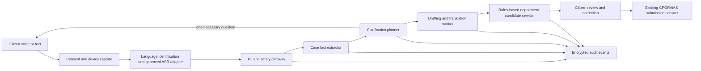

# Multilingual voice-to-grievance architecture

Status: prototype implemented; production system proposed
Decision date: 28 August 2026

## What the current demonstration actually does

The hackathon experience is intentionally lightweight and deterministic. A citizen can select one of 13 Indian speech locales, use the browser's speech-recognition capability when available, or run a no-permission sample journey. A bounded local state machine extracts a service, date or period, location when relevant, and requested resolution. It asks one missing question at a time, creates an editable formal draft, and carries the citizen-approved text into the existing grievance form.

This is not a deployed language model or a government integration. Audio is not uploaded or stored by this application. Browser speech recognition may use a browser-vendor service, so the interface warns citizens not to speak sensitive data. The sample journey remains available when speech support or microphone permission is absent.

## Non-negotiable safeguards

1. The citizen's original statement is included verbatim and is never silently replaced.
2. A draft is a suggestion until the citizen reviews and continues.
3. No agent may reject, downgrade, close, submit or finally route a grievance.
4. Aadhaar, OTP, passwords, bank details and unnecessary personal data must be detected and blocked or redacted before any model call.
5. Every question and transformation must have a traceable reason and structured input/output.
6. Typing, assisted service-centre entry and the deterministic path remain available when speech or AI fails.

## Production target

The term “multi-agent” means bounded, schema-driven workers behind one orchestration service—not open-ended autonomous agents.

### Logical workers

| Worker | Bounded responsibility | Output |
| --- | --- | --- |
| Language and ASR adapter | Detect language/code-switching and transcribe through an approved provider such as a future Bhashini adapter | transcript, language, confidence, word timings |
| Safety gateway | Detect prohibited secrets, minimise PII and enforce consent/retention policy | redacted transcript, warnings, policy decision |
| Case fact extractor | Extract service, event, date, place, parties and requested action | versioned `CaseFacts` JSON |
| Clarification planner | Select at most one material missing field per turn | question key, rationale, completion score |
| Drafting worker | Produce plain-language and formal versions without deleting the original | structured draft with source spans |
| Routing candidate service | Combine an approved rules catalogue with model suggestions | ranked candidates and explainable rule matches |

The UI talks to a single `GrievanceAssistPort`. The prototype adapter is deterministic. A production adapter may orchestrate approved ASR and language models without changing the citizen workflow.

## Scale and reliability

- Keep the web and orchestration tiers stateless; store a short-lived encrypted conversation state with an explicit expiry.
- Stream audio in small chunks to regionally deployed ASR workers; queue longer recordings and apply per-language autoscaling.
- Cap turns, audio duration, tokens and execution time. Use circuit breakers and return to typing or a human facilitation desk on timeout.
- Cache only non-personal language resources, department catalogues and policy prompts. Never cache citizen transcripts in a shared response cache.
- Use an append-only event record with prompt/schema version, confidence, citizen correction and selected route, but no raw audio by default.
- Measure task completion, correction rate, missed-field rate, ASR word error rate and time to approved draft—not model fluency alone.
- Test separately for every supported language, dialect, code-switched pattern, noisy environment, gender and disability scenario. A 23-language production claim requires representative audited datasets, not interface options.

## Privacy and government readiness

Production requires a DPIA, threat model, records schedule, procurement approval and hosting/integration decisions by the responsible government owner. Audio capture needs an unambiguous microphone indicator and purpose notice. Raw audio should be transient by default, encrypted in transit, deleted after transcription, and retained only through a separately approved evidence workflow. Model providers must use no-training/no-retention controls where available; model calls must use structured outputs and a deny-by-default egress policy.

## Delivery phases

1. **Hackathon demo:** browser speech + deterministic extraction and drafting; synthetic complaints only.
2. **Usability pilot:** consented, supervised testing with multiple accents and low-literacy participants; no live case submission.
3. **Controlled language pilot:** approved ASR/model gateway, human review, limited departments and audited evaluation thresholds.
4. **Government integration:** security assessment, accessibility conformance, production SLOs, authorised hosting and signed CPGRAMS adapter agreement.

## Definition of success

A citizen who cannot comfortably type can describe a public-service problem, understand each follow-up, correct the system, approve an accurate draft and reach the normal review page. Success is not “the AI answered”; it is an informed citizen retaining control over a complete, traceable grievance.

